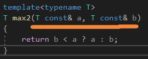
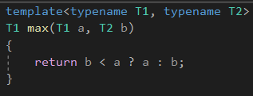
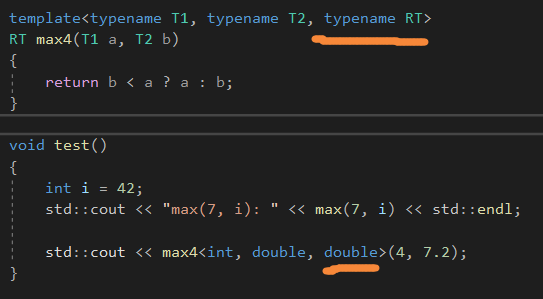
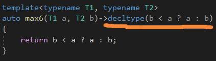
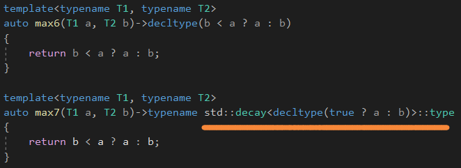
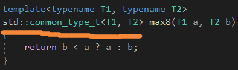
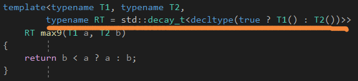
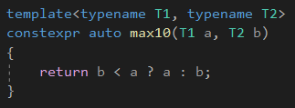
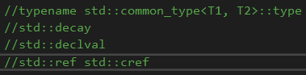

# Function Template


函数模板由于是参数化的，因此它们表示一个家族的函数。


不同的实体**从模板生成**，对于每个类型，当模板使用的时候。这个是实例化的定义。


void也是一个有效的模板参数。


## Two-Phase Translation


模板编译有两个阶段：

1.定义时间没有实例化，模板会首先忽略模板参数。

-语义检查，比如是否丢弃了分号。

-使用未知的名字，类型名，函数名，那些不依赖于模板参数的名字。

-那些不依赖模板参数的静态断言。


2.实例化阶段，模板代码被再次检查，检查代码是否有效。

那些**依赖于**模板参数的代码会被第二次检查。


但是这个二阶段的检查会破坏和普通函数编译的差别，因为编译器需要知道模板函数的完整定义，

而普通函数只需要一个声明。


暂时的解决方式：放在一个头文件里面。


## Template Argument Deduction


当参数是引用类型，即使是微小的类型转换也是不允许的。而且类型必须是一致的。



a的类型和b的类型必须一致。


当参数是传值类型，const和volatile会被忽略，**引用转换成被引用的类型**，原生数组或者函数会被转换成相应的指针类型。

退化后的类型必须一致。


阻止错误的方式：

1.强制类型转换

2.显式描述类型

3.描述模板参数可以是不同的类型


## Type Deduction for Default Arguments

注意，函数默认参数是不能被推导的。


解决方式是，为模板类型参数**也添加默认类型参数。**


## Multiple Template Parameters



注意，这个函数的传入参数的顺序决定了返回值的类型。


有3种方式可以解决：

1.再指定一个模板类型参数，表示返回类型。

2.由编译器推导返回类型。

3.声明一个返回类型，是这两个类型的**公共类型。**


模板参数推导，不会将返回类型也参与进来的，因为返回类型没有在函数调用的参数里面。

因此，你必须完整地描述所有的类型。



或者，把模板参数返回类型放在第一个。

## Deducing the Retun Type

C++14，可以直接使用auto来推导返回类型，因此，它揭示了，它是从函数体的返回语句推导的类型。


C++11，可以使用尾置返回类型，从而使用函数参数，**或多或少让函数体的部分实现放置在声明里面。**




有一些情况下，传入的类型是引用，我们的返回类型要退化掉。



三目运算符的返回类型由**第二个和第三个**来决定的。


这里的这个auto本身自带了退化的功能的。


## Return Type as Common Type



输入两个类型，产生一个新类型。


```c++
//C++11
typename std::common_type<T1, T2>::type
//C++14
std::common_type_t<T1, T2>
```


## Default Template Arguments



可以使用默认模板参数，但是由于a和b这两个形参还没声明，我们需要调用它的构造函数。


std::decay_t保证了返回值没有引用。


std::declval保证了不需要调用构造函数，即可返回值。


也可以使用std::common_type<>。


最好就是让编译器自己推导，C++14的那个auto。


## Overloading Function Templates


函数模板也可以被重载。


重载解析规则更倾向于使用非模板函数。

## Pass by Value or by Reference?

更倾向于传值。


因为传值语义简单，编译器优化的更好，**移动语义使得拷贝更加便宜**，有时候这里根本没有拷贝或者移动。


可以使用std::ref()或者std::cref()代替传引用。


传递字符串字面值和原生数组会导致一些问题，因此选择传值非常时候它们，因为会退化。


## Why Not inline?

函数模板不需要用inline声明。不像普通非内联函数，我们可以定义非内联函数模板在头文件里面，并且包含在多个翻译单元。


## Why Not constexpr?

自动C++11，我们可以使用constexpr，让一些计算放在编译期间。




# 总结

目前出现过的标准库的一些设施。




