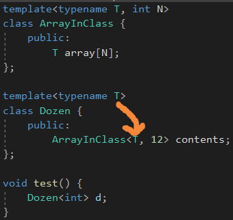

# Basic Template Terminology

terminology：术语

# “Class Template" or "Template Class"?

类模板表示一个家族的类，而模板类和类模板是同义词，但是更倾向于是从模板生成的类，同时也倾向于表示

带有名字带有<>的类。

# Template Arguments versus Template Parameters

ArrayInClass<double, 10>这种后面叫做template arguments，合并起来的叫做模板id。

parameters被arguments初始化。

argument必须在编译期间就确定。由于template parameters最终被编译期间的值替换，它们常用来组成编译期间的表达式。

进一步说明，template parameters是编译期间的实体，它们也可以用来创造有效的template arguments。

T是一个paramter，作为argument传入ArrayInClass。

