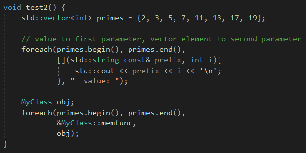
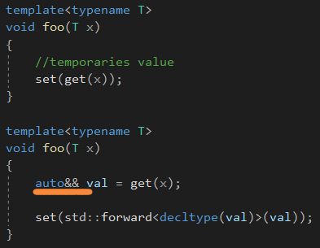

# Generic Libraries


# Callables

## Supporting Function Objects


函数名会退化成函数指针。


如果是传引用的话，就不会退化。


如果最后一个参数，我们声明为Callable const&，const会被忽略掉，因为const修饰函数没有用。


当定义operator()，你应该要把它定义为**常量成员函数。**

不然一些框架和库会报错，因为这些框架和库要求这个调用不会改变传递的对象的状态。


## Dealing with Member Functions and Additional Arguments


如果调用成员函数，需要类似object.memfunc()或者ptr->memfunc()这样的形式，和之前那种调用不一样。


自从C++17，这里提供了一个函数**std::invoke()**去统一成一样的形式。


分为两种情况：

第一种，如果op是成员函数的话，那么最后一个参数就作为对象的指针。

第二种，就是把最后的参数全部传入op。


**然后是相应的容器内的元素。**


这里没有使用完美转发，书上说，第一次调用会窃取它们的值，导致再后续的迭代中会产生出乎意料的错误。





## Wrapping Function Calls


std::invoke包裹了一个函数调用，例如，去日志一个调用，测量它们的持续时间，或者准备一些内容，例如开始一个线程。


decltype(auto)是C++14的东西。


decltype(auto)，由于decltype需要一个表达式，因此将auto代入，注意，decltype是不会退化的，而auto会，因为有时候，**我们需要一些类似能够完美转发回调用者std::ostream的东西。**


不使用auto&&的原因是，auto&&是个万能引用，会延长声明周期，不管是什么类型，都会变成引用类型。


而decltype(auto)有个缺点，就是不能返回void*，因为它是个不完整的类型。


一种就是定义一个对象，它的析构在那条语句之前执行，使得可以观察到你想理解的行为。


另一种就是编译期间的表达式。


# Other Utilities to Implement Generic Libraries

## Type Traits

类型萃取允许我们求值和修改类型。


if constexpr是C++17的东西，我们可以使用std::enable_if，部分特例化，或者SFINAE去代替关闭和开启函数模板。


注意，std::remove_const_t只移除顶层const，

std::remove_const_t&lt;int const&&gt;只生成int const&。


所以，顺序是非常重要的：

```c++
std::remove_const_t<std::remove_reference_t<int const&>>;//int
std::remove_reference_t<std::remove_const_t<int const&>>;//int const
```


也可以调用如下的：

```c++
std::decay_t<int const&>;//yields int
```


还有很多类型萃取，在P165有详细的讲解。


## std::addressof()

可以获取一个对象或者函数的地址，**即使这个对象类型有一个重载操作符&。**


## std::declval()


std::declval()函数模板可以被用来当作一个占位符，对于一个确切类型的对象的引用。

这个函数没有一个定义，因为不能被调用，所以不能创建一个对象。

因此，它只能被用在未求值的操作上(比如decltype和sizeof构造)。因此，你可以假设你有一个确定类型的对象，但是不能创建它。


三目运算符根据后面两个表达式**产生一个公有的类型**，然后再退化。


使用std::declval去使用相应类型的对象，而不需要去创建它。**这只能存在于decltype这种未计算的语境中。**


std::declval()会产生一个右值引用，因此要退化一下。


# Perfect Forwarding Temporaries



使用这个来减少无关的拷贝。


# Reference as Template Parameters

模板类型参数可以是引用类型。


如果T显式传入一个引用，那么推导就不会发生，就会返回true，**而默认传值是会发生退化的。**


第二个为false的原因是，对于引用变量v来说，表达式v有引用类型，但是一个表达式的类型永远不是一个引用。


这里报了很多错误。有一个成员类型T，被一个非类型模板参数Z初始化，它有一个零初始化的默认值。


当尝试实例化这个类，使用引用的时候，事情将变得tricky。

1.默认值不再工作

2.不能传递0作为初始值对于int

3.赋值操作符不再可用，因为类有一个非静态引用成员，会删除赋值操作符


注意这里的非类型模板参数SZ是int&类型的，因此会发生错误。


为了能够使用赋值操作运算符，比如std::pair<>和std::tuple<>使用了自己实现的赋值操作运算符。


由于这个负面影响的复杂度，实例化C++17的类模板std::optional<>和std::variant<>对于引用类型是不合法的。


为了阻止引用，一个简单的静态断言是非常有必要的。


# Defer Evaluations

延迟计算。


当实现模板，一些问题产生了，是否代码可以用不完整类型来解决。


Cont可以接收不完整的类型。


使用一些trait，你可能会失去能力去解决不完整类型。


这里，我们使用std::contional去决定成员函数foo的返回类型是T&&还是T&。

这个决定依赖于模板参数T是否支持移动语义。


std::is_move_constructible要求T是完整的类型。

我们解决这个方法可以通过如下的形式：


我们可以解决这个问题，通过替换foo()为成员函数模板，那么std::is_move_constructibe就被推迟到实例化foo()的时候。


整个的思路，就是想使用不完整类型和trait一起，**我们需要把实例化推迟。**


