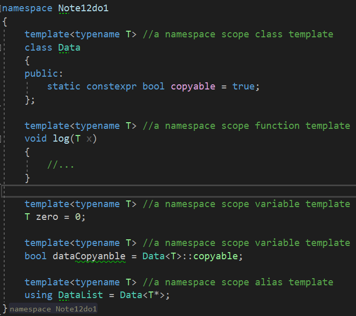

# Fundamentals in Depth

template parameters：模板的声明参数

template arguments：实例化模板的参数


# Parameterized Declarations

参数化的声明


C++现在地支持四种基础类型的模板：类模板，函数模板，变量模板，还有模板别名。

这些模板种类的每一个可以出现在命名空间作用域，但是也可以在类作用域。


在类作用域，它们变成**内嵌**的类模板，成员函数模板，静态数据成员模板，还有成员别名模板。

这样的模板被声明看起来像是普通的类，函数，变量，还有类型别名，除了现在引入，通过一个参数化的条款形式：

```c++
template<parameters here>
```


注意，C++17引入了另一个建筑，它被引入，使用这样一个参数化条款：推导指导。

这些不叫作模板在这本书，**但是语法被选择去回忆函数模板。**


我们将回到真正的参数声明在之后的节。第一步，一些例子解释了四种类型的模板。它们可以出现在命名空间作用域(全局地或者在一个命令空间)

依下例各项：




注意，在这个例子，静态数据成员Data<T>::copyable不是一个变量模板，即时它是间接地被参数化通过类模板Data的参数。

**然而，一个变量模板可以出现在类作用域(下一个示例将说明)，并且在那种情况，它是一个静态数据成员模板。**

下面的例子展示了四种类型的模板作为类成员，被定义在它们的父类里面：


第一个是in-class成员类模板定义，第二个是in-class(并且因此隐式地内联)成员函数模板定义，第三个是**成员变量模板(出现在了类作用域)**，第四个是成员别名模板。


