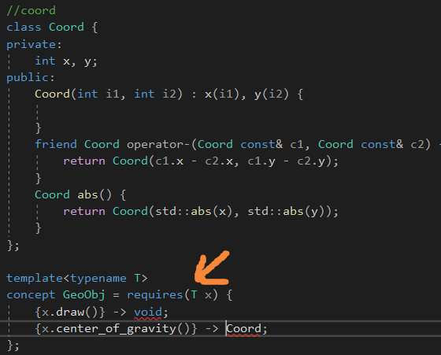

# Dynamic Polymorphism

动态多态性。

使用继承和虚函数。

标识一个公有集合的能力在不同相关对象的类型之间，并且声明它们作为虚函数接口在公共基类里面。

heterogeneous adj.各种各样的

# Static Polymorphism

模板可以用来实现静态多态性，它们不依赖于在基类里面的通用行为。

它们的操作必须是同样的名字。

具体的类之间的定义是独立的。

当模板实例化的时候，多态的力量才开启。

静态多态性，但是异质集合不能使用了，只能使用同质的集合。

**因为所有的类型必须在编译期间决定。**

相反的，我们可以轻松地引入不同的集合，对于不同的集合对象类型。

**这里没有要求，集合必须限制在指针上了。**

合并两种形式：

为了处理异质集合，需要从公有的基类里面继承不同的子类。

然而，依赖可以使用模板去写代码，对于不同的几何对象。

成员函数被参数化，**使用继承基于CRTP。**

# Using Concepts

如果没有相应的接口，模板实例化的时候就会发生难以理解的错误。

因此，C++提供了一个叫做concept的东西。

这代表了一组限制，模板参数必须被填充，去成功地实例化一个模板。

concept可以理解为静态多态性的接口。

类似于这样的东西。

我们使用关键字concept去定义一个concept GeoObj，去限制了一个类型**去有一个可调用成员**

draw()和center_of_gravity()。

注意，这个const成员函数，也就是不能通过this指针修改成员类型，如果没有这个const，就会报错，当传入myDraw的时候。

这个方法仍然是非侵入式的，**侵入式，则要继承拥有接口的类。**

# New Forms of Design Patterns

静态多态性的可利用性，导致可以将设计模式使用不同的方式实现。

比如，桥接模式。

# Generic Praogramming

STL中的算法是用模板编写的，因此它不是一个容器的成员函数，可以被用到各个容器上。

为了这样做，STL设计了定义了一个抽象概念iterators，**可以被用来提供给不同的线性集合。**

只要保证容器提供创建迭代器的接口即可。

迭代器有一定数量的接口，且被容器提供，被用在算法上。

除了concept，一些特性，比如static_assert和SFINAE批准一些自动的检查。

