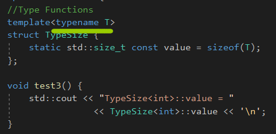
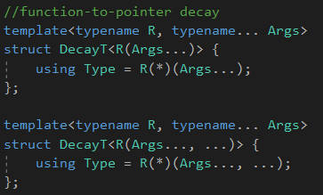

# Fixed Traits


这里只有微妙的决定，是如何创建一个零值对于确定的类型，去开始我们的累加。


我们使用值初始化，使用{}，意味着局部对象要么被默认构造函数初始化，**或者被零值初始化(比如nullptr对于指针，而false对于bool值)。**


计算字符数组的时候，**由于范围太小，而导致越界。**


一种解决方式：

```c++
accum<int>(name, name + 5);
```


另一种解决方式，创建一种联系在每个类型T以及相应的类型，**这种类型被用来持有累加的值。**

叫做T的trait。


使用模板特例化，由于不会使用主模板，因此，我们没有它的定义。


这种模板叫做萃取模板，因为它持有它的参数类型的特性。


修改后的函数。


# Value Traits

trait表示额外的类型信息，和一个给定"main"类型相关。

**不只是限制于类型。**常量和其它类的值也可以联系起来。


我们初始的accum模板，使用了默认构造函数对于返回值，去**初始化结果变量，我们希望的像零一样的值。**


AccT不一定有默认构造函数，我们可以添加一个value trait到我们的AccumulationTraits。


我们的新trait提供一个零元素作为一个常量，可以在编译期间计算。


C++允许去初始化一个静态常量数据成员在它的类里面，**如果它有一个整型或者枚举类型。**


constexpr静态数据成员允许浮点数。


对于用户自定义的数据类型，一种解决方式就是，初始化别写类里面。

```c++
template<>
struct AccumulationTraits<BigInt>{
    using AccT = BigInt;
    static BigInt const zero;//只声明
};

BigInt const AccumulationTraits<BigInt>::zero = BigInt{0};
```


C++17支持内联：

```C++
template<>
struct AccumulationTraits<BigInt>{
	using AccT = BigInt;
	inline static BigInt const zero = BitInt{0};
};
```


C++17，支持内联成员函数。


但是获取的形式需要发生改变。


# Parameterized Traits


之前的Trait被叫做fixed，因为一旦trait被确定，那么它不能在算法中替换。


我们可以增加一个模板参数AT，**同时有一个默认值被trait模板决定。**


现在trait可以进行替换了。


一般用户都不需要提供第二个参数。


# Traits versus Policies and Policy Classes


accumulation的操作不仅可以累加，也可以是累乘，对字符串来说，可以是连接，**这个操作可以称之为policy，对于我们的累加过程来说。**


SunPolicy是个策略类，策略类是封装算法的。

一个类实现一个或多个策略通过一致的接口，这里是accumulate。


累乘的策略类，但是乘出来结果是0，这给我们一个启发，就是决定初始值应该交由策略类。

但是不一定所有事情都要由trait和policy决定，**STL的accumulate的第三个参数就是初始值。**


# Traits and Policies: What's the Difference?


policies是trait的一种特殊情况。


Trait表示模板参数自然额外的属性。

Policies表示可配置的行为，对于通用的类型和函数。


# Member Templates versus Template Template Parameters

成员模板对比模板模板参数。


我们可以把策略实现为一个类模板，然后使用模板模板参数。


模板模板参数。


这里实例化这个类，**用其它模板参数来实例化模板模板参数。**


一般来说，trait排在policy后，写的时候，因为用户一般会重写这个策略的行为。


# Accumulation with General Iterators


处理通用迭代器，而不是普通的指针。

但是普通的指针依然可以使用，因为STL提供了一个**iterator traits。**


通用迭代器。


std::iterator_traits结构封装了所有相关迭代器的属性。

由于部分特例化的存在，**这些trait可以方便地使用在指针上。**


STL的trait的实现。


# Type Functions


类型函数。


使用模板，我们可以额外地定义类型函数。

函数取一些类型作为参数，并且产生一个类型或者常量作为结果。


一个非常有用的类型函数是sizeof。


类模板可以被当成类型函数。

**类型函数的参数是模板类型参数，结果被抽取出来作为成员类型或者成员常量。**





打印类型名。


实现其实可以简化的。

**如果容器类型定义了一个成员类型value_type。**


我们可以实现如上的形式。


建议提供成员类型定义对于类模板参数，所以它们可以在通用代码中轻松地访问。

**像标准容器模板一样。**


类型函数的作用就是，参数化一个模板依据容器的类型而不需要额外提供别的类型。


本来要提供返回值类型的，现在不需要，**只需要提供一个类型函数，抽取出容器的元素类型即可。**


**元素类型是被类型函数决定的。**


类型ElemenT被叫做trait class，**因为它被用来访问一个给定容器类型C的trait。**

萃取类，不只限于描述容器元素类型，也可以是任何种类的主参数。


用别名模板简化。


# Transformation Traits


## Removing References

除了从特定角度提供能力访问主模板参数，**traits也可以执行转换在types上。**

例如增加或者移除引用或者const或者volatile修饰符。


去除引用是非常有用的，**当函数的返回类型是引用类型的时候。**


标准库提供了一个std::remove_reference<>。


## Adding References

我们可以使用一个现有的类型，然后从它创建左值引用或者右值引用。


引用折叠会应用在这上面。


轻量级的结构，但是我们不能使用void在这上面。


但是类模板的特例化可以处理特殊情况。


右值引用也同样。


C++标准库，**提供std::add_lvalue_reference<>和std::add_rvalue_reference<>。**


## Removing Qualifiers


变换可以组合。


这里用到了元函数转发，从继承Type成员，从RemoveConstT，这样就减少了定义。


标准库提供了相应的trait，**比如std::remove_volatile<>，std::remove_const<>，std::remove_cv<>。**


## Decay


传值，退化了。


int const、int [7]、int(int)退化成int, int\*, int(\*)(int)。


我们可以实现这种机制的trait。




第二种是为了兼容C语言的varargs。


使用自制的trait。


## Predicate Traits

谓词萃取。


我们可以发明一个类型函数，它依赖于多个参数。

**类型谓词(类型函数生成一个布尔值)。**


C++标准库有一个对应的类型萃取，std::is_same<>。


## true_type和false_type


现在IsSameT<T, int>的结果类型，隐式地转变成它的基类TrueType或者FalseType，不仅提供正确的value成员，

**也允许我们去派发到不同的函数实现或者部分类模板的特例化在编译期间。**


例如：


这种技术叫做**标签派发。**注意，true和false是值，而TrueType和FalseType是裹了它们两个值的类模板，因此可以通过类型匹配，

选择不同的函数。


**继承一个类，然后能够隐式转换成这个类，从而调用不同的重载函数。**


注意，TrueType和FalseType是类型，IsSameT继承自这个类型，隐式地转换成它们。


为了尽可能通用，这里应该只有一种类型标识true，一种类型表示false，**代替每个模板库定义它自己类型对于布尔常量。**


标准库：

```c++
//C++11和C++14
using true_type = integral_constant<bool, true>;
using false_type = integral_constant<bool, false>;

//C++17
using true_type = bool_constant<true>;
using false_type = bool_constant<false>;

//bool_constant定义如下
template<bool B>
using bool_constant = integral_constant<bool, B>;
```


## Result Type Traits

结果类型萃取。


另一个解决多个类型的关于类型函数的例子是result type traits。

**它们非常有用，当书写操作符模板的时候。**


为了获取T1，T2两个的结果类型。


PlusResultT trait决定了被生成的类型，通过相加两个类型的值，使用+ operator。


有些些小问题，就是要求T1和T2必须拥有可以访问，非删除的，默认构造函数。


### declval


C++标准库提供了std::declval<>，即使没有构造函数也能产生值。


declval的定义：

```c++
template<typename T>
add_rvalue_reference_t<T> declval() noexcept;
```


declval&lt;T&gt;产生类型T的一个值。

这个函数模板故意没有定义，就像sizeof、decltype一样。


使用这两个，就能消除值初始化的要求了。


# SFINAE-Based Traits


SFINAE允许替换失败的时候，使用重载解析，**去选择一个不同的候选者。**


SFINAE不仅支持函数重载时的错误，也可以判断一个类型是否有特定的成员，支持一个特定的操作，或者一个类。


## SFINAE Out Function Overloads


第一次SFINAE的尝试是判断一个类型是否能够默认构造。


对于一个类型T，一个表达式，比如T()必须是有效的。


使用重载解析，来实现SFINAE-base trait。**注意，SFINAE是函数重载才有的。**


对于任何的T，总是，所有的成员函数被替换，对于一个不能默认构造的类型，代码会编译失败，而不是忽略第一个test()重载。


但是这个代码不知道为啥也能编译通过。


## Alternative Implementation Strategies for SFINAE-based Traits


C++98就有基于SFINAE的trait，它实现的方式是通过声明两个不同的重载函数模板返回不同的类型。


但是之前的实现是通过判断返回类型的大小来选择不同的重载解析的。

```c++
template<...> static char test(void*);
template<...> static long test(...);

enum{value = sizeof(test<...>(0)) == 1}
```


因为没有constexpr和nullptr。


老的机子的long和char类型相同，但是我们可以用如下的方式进行解决。

```c++
using Size1T = char;
using Size2T = struct{char a[2];}

//我们可以定义test()重载如下
template<...> static Size1T test(void*);
template<...> static Size2T test(...);//callback
```


## Making SFINAE-base Traits Predicate Traits


一个谓词trait，返回一个布尔值，应当返回一个从std::true_type或者std::false_type派生的值。

trait应当从帮助类中派生，从而产生需要的基类。


如果test()函数模板是有效的，它是更好的重载，那么IsDefaultConstructibleHelper::Type被初始化test()的返回值。

**作为一个结果，IsDefaultConstructibeT从std::true_type派生。**


# SFINAE Out Partial Specializations

第二种方式实现SFINAE-based traits，使用部分特例化。


如果T无法构造，那么整个特例化版本就会被丢弃。


注意，SFINAE一开始是从函数重载引出的，**但是类的特例化可以实现这种效果。**


# Using Generic Lambdas for SFINAE

我们使用的一些技术，一些样板代码总是需要的去定义trait，重载并且调用两个test()成员函数或者实现多个部分特例化。


在C++17中，我们可以最小化样板代码，**通过描述这个情况检查在通用lambda里面。**


isValid，它是一个constexpr变量，它的类型是lambda闭包类型。**lambda创建了一个对象，并且返回。**

isValid能够调用。


用法如上。isDefaultConstructible是一个函数对象，类型的trait，**是否可以默认构造。**


isValid是个萃取工厂，一个组件，可以生成trait，检查它的可调用对象是否可用。


type helper变量模板表示一个类型作为值。值x从这种方式获取的可以还原成原先的类型，**使用decltype(valueT(x))。**


x是TypeT&lt;T&gt;类型的，valueT(x)抽取出T。


```c++
//用法，这里的参数就是args
isDefaultConstructible(type<int>);
isDefaultConstructibel(type<int&>);
```


这里内部那个进行了值初始化，decltype(x)，返回一个std::true_type或者std::false_type。


回忆SFINAE如何工作的？替换需要发生在替换模板的立即语境。


别名模板的使用。


一旦理解了，这个就很好用，比如hasFirst这个lambda测试是否有first成员，返回true_type或者false_type。


# SFINAE-Friendly Traits


一些trait在面对错误的时候不能友好地处理，比如这个，当T1和T2没有+运算符的时候，就会发生错误。

**没有被SFINAE进行保护。**


真正的错误其实发生在实例化PlusResult<A, B>的时候。


这是一个显著的后果：即使我们加了A和B的一个确切的重载，也会导致编译失败。

因为C++不确定是否使用函数模板，如果另一个函数重载更好。


为了解决这个问题，我们需要PlusResultT SFINAE友好地，我们定义了一个HasPlusT trait，**允许我们去检测这里是否有个合适的+操作**

**对于给定的类型。**


最佳的默认的一个Trait，没有有意义的结构，对于一组模板参数来说，就是不要提供任何成员Type。


由于SFINAE，没有Type成员，SFINAE就会考虑消除函数模板。**重载的operator + 因此会被选择。**


错误应该发生在PlusResultT<T1, T2>的实例化期间，**如果它实例化的时候，没有Type成员，那么就会考虑消除函数模板。**


注意后面那个重载版本的A和B是具体的类型。


作为一个设计准则，一个trait模板应当永远不能失败在实例化期间，如果给定的模板参数作为输入。

一个通用的解决方案是执行如下的检查两次：

1.一次找出是否操作是有效的

2.一次去计算它的结果


考虑ElementT，之前的，它从一个容器抽取出元素类型。

因为答案依赖于一个容器类型是否有一个成员类型value_type，我们应当定义成员Type，只有当容器类型有value_type成员的时候才可以：


类似这种。


所以，具体思路就是一个函数模板，一个具体类型的确切重载，然后函数模板要依赖类模板的部分特例化来达到没有成员，然后编译器就会消除模板。


注意，SFINAE一开始引入的时候，是函数重载的fallback。


**所以，整体的思路就是实例化成功，但是没有类型成员，则会消除模板。**


# IsConvertibleT


书上的例子不知道为啥，是错的，就是test有第二个模板类型参数，但是没有用到。


## Handling Special Cases


有些特殊情况我们进行处理

1.转换成数组类型，应该总是产生false，但是在我们的代码里面，aut的参数T0会退化成指针，因此会有一些true的结果，对于一些FROM类型。

2.转换成函数类型应当总是产生false，和1相同。

3.转换成(const/volatile修饰符)的void会产生true。但是我们的实现不能将TO实例化成void。


我们需要额外的部分特例化。

然而，添加部分特例化，对于可能的const和volatile修饰符很快地变得永无止境，

**我们可以添加额外的模板参数。**


对于特殊情况，我们会使用第一个类模板。


IsVoidT这种会产生std::true_type这样的类型，然后通过Value获取。


# Detecting Members


如果检测失败，那么就会抛弃这个特例化版本。然后回退到主版本。


但是size_type是私有的，**那么我们就访问不到，就会产生false。**


## Dealing with Reference Type

处理引用类型。


# Detecting Arbitrary Member Types


参数化trait，从而能够检测任何成员类型的名字。


只能通过宏，才能参数化类型名。


# Detecting Nontype Members


检测非类型成员的方式，Member名字必须是唯一的，可以访问，非类型，非枚举成员，

如果T::Member是个静态数据成员，它的类型必须不要提供operator&。


这里而且使用了部分特例化。


# Detecting Member Functions


# Detecting Other Expressions


检测其它表达式。


但是这样检测是非常粗糙的，如果<有多个重载，删除的，不可访问的，那么就检测不出来。


**合并多个限制在一个trait里面。**


# Using Generic Lambdas to Detect Members


使用通用Lambda检测成员。


# If-Then-Else


IfThenElse根据**布尔非类型模板参数**选择不同的类型参数。


和普通的if else不同，它的两个分支都会求值。


比如这个，std::make_unsigned，它需要传入的类型是一个有符号整型并且不是布尔值，不然它的使用会导致意味的行为。


但是IfThenElse两个分支都会求值。


可以间接地解决。


IfThenElse的类型参数是两个类型函数本身。然而，这两个类型函数在IfThenElse选择其一后求值，

IfThenElse选择类型函数的实例。::Type在IfThenElse选择完一个实例后求值，产生Type。


MakeUnsigned其实不用包裹，**但是要求IdentityT&lt;T&gt;有type成员。**


C++标准库，**有一个std::conditional<>。**


# Detecting Nonthrowing Operations


检测是否抛出异常。


最直接的方式就是使用noexcept，T(XX)，里面是个移动构造函数。


noexcept里面的表达式，如果不抛出异常，那么就返回true。


在部分特例化中的std::void_t如果替换成功，那么这个部分特例化的版本就会被选择。

并且在基类修饰的地方，也能够安全地求值。


**标准库有个std::is_move_constructible<>。**


# Traits Convenience

使用别名模板和变量模板，我们可以简化trait的用法。


但是在一些语境下，这些捷径是不能够使用的，我们需要使用原来的类模板来代替。


## Alias Templates and Traits


别名模板的缺点：

1.别名模板不能被特例化。


2.一些trait被用来给用户特例化，它会混乱特例化类模板，当很多使用参与到其中的时候。


3.使用别名模板总是会实例化类型。

最后一点，就是别名模板不能用来**元函数转发。**


## Variable Templates and Traits

...


# Type Classification


有时候，我们需要判断一个模板参数是一个内建类型，一个指针类型，一个类类型。


标准库提供了这些设施。


我们可以使用部分特例化和编译期间的if。


# Determining Fundamental Types


模板 + 宏，**为每个基础类型定义偏特化的版本。**


主模板定义了通用的情况。

通常，IsFundaT&lt;T&gt;::value会产生false。

```c++
template<typename T>
struct IsFundaT : std::false_type{
	static constexpr bool value = false;
}
```


特例化版本：

```c++
MK_FUNDA_TYPE(bool)

//展开为
template<> struct IsFundaT<bool> : std::true_type{
	static constexpr bool value = true;
};
```


用法如上。


我们可以定义类型函数IsIntegralT和IsFloatingT去表示这些类型中哪一个是整数标量类型，哪一个是浮点标量类型。


C++标准库定义了一些类型目录，更加地细粒度。

# Determining Compound Types

决定复合的类型。


简单的复合类型可以被分类，使用部分特例化。


比如指针，标准库里面有个std::is_pointer<>。


标准库有std::is_lvalue_reference<>和std::is_rvalue_reference<>，还有std::is_reference<>。


数组类型如上。


std::is_array<>检查是否是数组，std::rank<>和std::extent<>**允许我们访问它们维度的数量和确切维度的大小。**


# Pointers to Members


C++标准库提供了确切的trait，std::is_member_object_pointer<>和std::is_member_function_pointer<>。


# Identifying Function Types


variadic表示是否使用C风格的varargs。


但是函数还有const、volatile、noexcept修饰符，还需要大量的部分特例化版本。


C++标准库提供了std::is_function<> trait。


# Determining Class Types


不像其它复合类型，我们没有部分特例化一样，匹配所有的类类型。

一个有用的方法，就是只有类类型可以**被用来作为指向成员指针的类型。**


C++标准库有std::is_class<>和std::is_union<>类型。


C++语言描述lambda表达式是一个独一无二的，无名的非联合类类型。


**C++标准库提供traits，std::is_class<>和std::is_union<>。**


# Determining Enumeration Types

决定枚举类型，就是排除其它的类型。


C++标准库提供std::is_enum<>类型。


# Policy Traits


之前的都叫做property traits。


相反的，一些traits定义一些trait如何被对待。

我们叫这个为policy traits。


策略trait封装了策略在成员函数里面。


## Read-Only Parameter Types


比如我们可以根据类型的大小，使用传值还是传引用，大小不超过两个指针的，就使用传值。


但是数组类型，它们本身可能很小，本身持有一个指针，我们需要部分特例化。


**这里的类模板就是类型函数。**


由于vector、array这样的类型非常的普遍，因此，只标记一些类型可以平凡地拷贝和移动。


函数foo不能够使用模板参数推导，因为模板参数只出现函数参数里面。需要显式指明模板参数。


正确的解决方式如下：


# In the Standard Library


C++标准库定义了一些policy和property traits：

1.类模板std::char_traits被用来作为一个policy traits参数，通过string和I/O stream类。


2.适应算法被用来不同的标准迭代器上，一个简单的std::iterator_traits属性trait模板被提供。


3.std::numeric_limits非常有用，作为一个属性trait模板。


4.对于标准容器的内存分配类，使用策略trait类。


