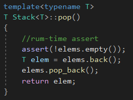
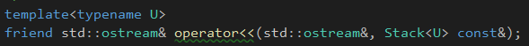
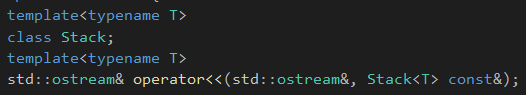
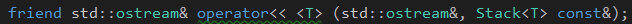
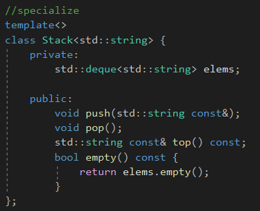
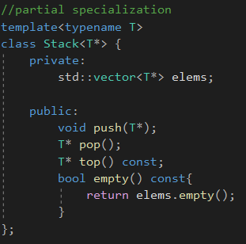
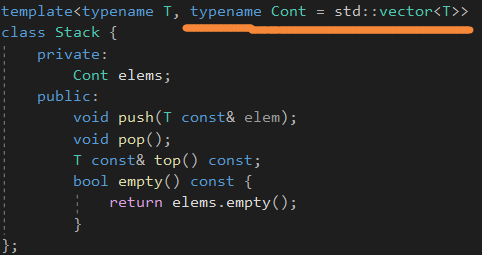
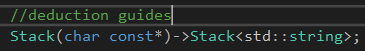
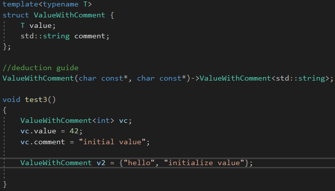

# Class Templates


## Implementation of Class Template Stack

Stack<T>在类的定义里面可以省略，但是在类外要全部写出来。




加assert的原因是为了判断容器是否为空。


直到C++17，类模板参数都需要显式地写出来，或者可以从构造函数那里面推导处理。


**注意，模板函数或者模板成员函数只要在被使用的时候才会实例化。**


## Partial Usage of Class Templates

类模板的模板参数需要提供那些要用到的操作，但是因为模板函数只有在被用到的时候才会实例化，即使缺少了相应的操作，

也是没事的。


## Concepts

Concept被用来表示一组限制，在一个模板库中。


但是C++11，可以使用静态断言以及一些预定义的类型萃取。


## Friends

友元函数不是一个函数模板，**是一个可实例化的普通函数**，当需要的时候。


当需要定义它在类外的时候，就变得复杂起来。



第一种方式，就是在类里面声明得时候，再套一个template&lt;typename U&gt;。


第二种方式：



在外面前向声明一下，然后再定义这个函数。



然后类里面表示使用一个特例化的版本。


注意，友元的含义就是**授权**。


## Specializations of Class Templates


如果一个特例化一个类模板，你就需要特例化这个类模板所有的成员函数。

当然也可以特例化一个成员函数，**但是一旦这样做了，你就不能特例化这个成员函数所属的整个类模板。**




类模板特例化的写法。


## Partial Specialization

部分特例化。


可以有一部分模板类型参数由用户指定。




注意部分特例化和特例化的区别，完全特例化的函数和普通函数一样。


部分特例化和特例化类名后面都会**跟着我们指定的一个类型参数**。


## Default Class Template Arguments



可以提供默认类模板参数。


## Type Aliases


typedef产生的名字叫做typedef-name，而using产生的名字叫做alias declaration。


## Alias Templates


```c++
template<typename T>
using DequeStack = Stack<T, std::deque<T>>;
```


## Type Traits Suffix_t


```c++
std::add_const_t<T>;//C++14

typename std::add_const<T>::type;//C++11

namespace std{
	template<typename T> using add_const_t = typename add_const<T>::type;//C++14
}
```


## Class Template Argument Deduction

C++17允许根据构造函数来推导出实际的类型。


## Vector的一些注意点

vector没有接收单一元素的构造函数，**只有初始化列表。**


## Class Template Arguments Deduction with String Literals


模板类型传值，将会退化，而如果是传引用，则是原生数组的类型。


## Deduction Guides



推演指导，可以控制实例化。


## Templatized Aggregates

模板化聚合




聚合类的推演指导。


如果ValueWithComment没有推演指导，那么这个初始化就不能执行，因为它没有构造函数去执行推演。


std::array<>就是一个聚合类，**参数化了元素类型和大小。**


