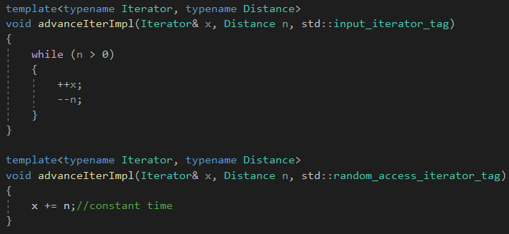
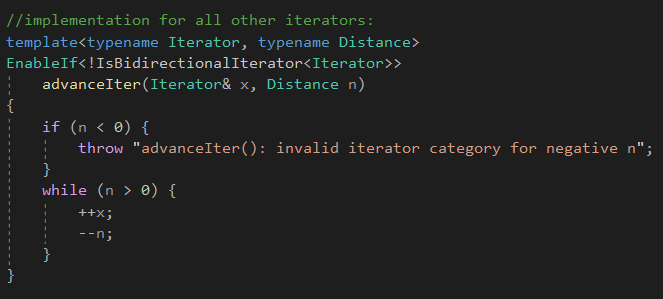

# Overloading on Type Properties

在比较两个函数是否一样的时候，函数模板的模板参数会被忽略掉。

这里有一些技术可以被用来产生重载的函数模板基于类型属性。

# Algorithm Specialization

这个函数的重载对于数组来说更加地高效。

这两个函数由于在比较的时候，会忽略模板参数，因此会发生冲突，**解决方式是使用标签派发。**

# Tag Dispatching

一种解决算法特例化的方法就是标识一个算法不同实现的变种，用一个唯一的类型，标识那个变种。

我们可以使用标准库的iterator category tag types。

**迭代器目录标签类型。**

注意，算法只有重载，没有特例化。

trait类std::iterator_traits对于迭代器，提供了一个目录，通过它的成员类型iterator_category。

迭代器目录描述了迭代器的类型是什么。

标准库提供了这些目录。

# Enabling/Disabling Function Templates

像std::enable_if一样，EnableIf别名模板可以开启关闭一个确切的函数模板在一个特定的情况下。

EnableIf特例化，用来开启advanceIter()，当迭代器是一个随机访问迭代器的时候。

当Cond为true的时候，EnableIfT&lt;...&gt;::Type简单地求取第二个模板参数。

当Cond为false的时候，EnableIfT不会产生一个有效的类型，因为主模板类EnableIfT**没有成员名叫Type。**

**没有成员名叫Type，在这里会触发SFINAE。**

通常，这会导致编译失败，但是在一个SFINAE语境中，**会造成模板参数推导失败，移除函数模板。**

还需要定义一个这个。因为触发SFINAE只是把这个函数模板移除，不考虑这个函数模板，但是还需要提供一个函数模板作为默认。

编译错误是发生在实例化期间，触发SFINAE要在替换的时候。

我们使用type trait IsConvertible，作为我们的条件语句，去定义一个type trait，**IsRandomAccessIterator。**

# Providing Multiple Specializations

如果我们想后退移动，通过描述一个负值。

标准库提供了一个概念，双向迭代器，允许后退移动，不需要随机访问。

额外添加一个双向迭代器的判断比较复杂，需要考虑很多种情况：

1.随机访问迭代器：随机访问情况(常量时间，向前或者向后)

2.双向迭代器和非随机访问：双向情况(线性时间，向前或者向后)

3.输入迭代器和非双向情况：普通(线性时间，向前)

每次算法的一个新的变种被引入，算法变种的情况需要被修改去保证它们是互斥的。

但是，使用标签派发，只需要新的avdanceImpl重载，使用新的标签std::bidirectional_iterator_tag。

# Where Does the EnableIf Go?

EnableIf用来在函数模板的返回语句。然而，这个不能工作在构造模板或者转换函数模板，因为它们没有返回语句。

使用EnableIf会是的返回语句难以阅读，**我们可以把EnableIf嵌入到一个默认模板参数里面。**

然而，这里有一个问题。如果我们添加另外一个重载，它会导致一个错误：

重复定义的问题。

问题在于两个构造函数是否相同，是会忽略掉默认模板参数的。

解决这个问题，可以添加另外一个额外的模板参数。

多出了一个额外的模板参数。

# Compile-Time if

越特例化的路径会被支持它的类型实例化。

# Concepts

C++20的concept更棒。

requires描述了模板的需求。

如果任何需求不能满足，**模板不会被考虑为一个候选者。**

# Enabling/Disabling Class Templates

去关闭/开启类模板的不同实现的方式是使用类模板的开启或关闭的类模板的特例化。

不像重载函数模板，**我们不需要关闭任何情况在主模板**，因为任何部分特例化版本都优于主模板。

原先的函数重载的主函数**都需要一个模板类型参数来判断情况的。**

# Tag Dispatching for Class Templates

标签派发，可以在类模板部分特例化中选择。

模仿函数模板的重载解析的方式就是**使用函数重载。**

使用类模板来模仿函数模板的重载解析。

这里括号应该是<>，不小心写错了。

MatchOverloads模板使用了递归继承去**声明**一个match()函数，在类型的集合里面。

每个实例化的递归MatchOverloads部分特例化引入了一个新的match()函数，对于下一个在列表中的类型。

如果没有一个匹配，第二个类模板会被选择，它的参数是...，表示fallback。

BestMatchInSet转换一个函数重载的结果到一个trait里面，并且使得它相对简单地使用标签派发去选择类模板的特例化版本。

# Instantiation-Safe Templates

EnableIf技术的本质是开启一个特定的模板或者部分特例化，**只有当模板参数符合一些标准的时候。**

如果我们把这个概念发挥到极致并且编码每个操作，模板执行它的模板参数作为EnableIf条件的一部分。

实例化这样一个模板永远不会失败，因为模板参数没有提供相应的操作会导致推导失败而不是允许实例化进行。

**我们倾向于这样的模板是实例化安全的模板。**

x3、x4、x6、x7，错误不是来自于min()的函数体，因为它们有非实例安全的变种。

它们抱怨这里没有合适的min()函数，因为已经被SFINAE给消除了。

MSVC报的错误是没有相应的函数实例。

报的是这样的错误，而不是来自min函数本身的错误。

**如果我们还有额外的普通的函数重载，那么就会选择这些函数重载，函数模板是被忽略掉的。**

所以，SFINAE的作用是忽略掉函数模板，去选择不同的重载函数。

X7的错误，是因为它的结果无法隐式地转换成bool。

一个显式的转换成bool可以被隐式地使用在特定的语境，包括布尔条件情况，比如if，while，for，and do，还有内建的!，

&&，还有||操作符，还有三目运算符?:，**在这些语境下，这个值被叫做语境上可以转换成bool。**

为了修复实例化安全的min()，我们需要一个trait去决定是否一个类型T是语境转换成bool。

X7被修复了。

