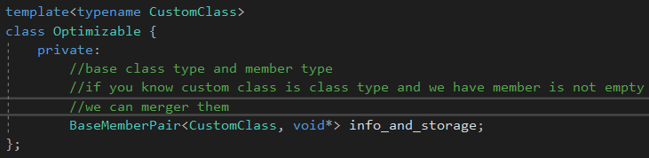

# EBCO

一个空类：只包含类型成员，**非虚函数成员**，静态数据成员。


EmptyToo继承Empty，EmptyThree继承EmptyToo。

那么Empty对于EmptyToo如果是个空基类的话，就会被优化掉，这就是EBCO名字的由来。


EBCO的限制，一个类如果同时继承一个类两次，就不会被优化，因为同个类的对象需要不同的偏移。


## Members as Base Classes

ebco没有那种作为数据成员的等价表示。因为它会造成一些问题，当用指针指向成员的时候的表示。


```c++
template<typename T1, typename T2>
	class MyClass {
		private:
			T1 a;
			T2 b;
	};
```


当传入两个空类型的话，那么MyClass的每个实例都会浪费一个字节的数据。


```c++
	//also have their problem
	//t1 and t2 could not substituted with nonclasstype or union type
	//substituted with same type are also have problem
	//t1 or t2 will final
	template<typename T1, typename T2>
	class MyClass : private T1, private T2 {

	};
```

替换成这样，也会产生问题。


还有添加一个基类会导致接口的改变，因为从一个模板类型参数继承，会影响一个成员函数是否是虚函数。


## 解决方法

当一个模板参数要被替换的时候，只有当另一个模板参数成员是可用的情况下。


主要思想是合并潜在的空基类类型参数和另一个成员，使用EBCO。



如果我们的模板参数为一个类类型，而我们又有一个非空的数据成员，我们可以合并它们，

通过让BaseMemberPair继承CustomClass，拥有非空类型的数据成员，进行优化。

这个Optimizable通过替换一个空类的类型，只有指针大小。

```c++
template<typename CustomClass>
	class Optimizable {
		private:
			CustomClass info;//might be empty
			void* storage;
	};
```

原先的版本，因为内存对齐的缘故，有16字节。


