# EBCO

一个空类：只包含类型成员，**非虚函数成员**，静态数据成员。


EmptyToo继承Empty，EmptyThree继承EmptyToo。

那么Empty对于EmptyToo如果是个空基类的话，就会被优化掉，这就是EBCO名字的由来。


EBCO的限制，一个类如果同时继承一个类两次，就不会被优化，因为同个类的对象需要不同的偏移。


## Members as Base Classes

ebco没有那种作为数据成员的等价表示。因为它会造成一些问题，当用指针指向成员的时候的表示。


```c++
template<typename T1, typename T2>
	class MyClass {
		private:
			T1 a;
			T2 b;
	};
```


当传入两个空类型的话，那么MyClass的每个实例都会浪费一个字节的数据。


```c++
	//also have their problem
	//t1 and t2 could not substituted with nonclasstype or union type
	//substituted with same type are also have problem
	//t1 or t2 will final
	template<typename T1, typename T2>
	class MyClass : private T1, private T2 {

	};
```

替换成这样，也会产生问题。


还有添加一个基类会导致接口的改变，因为从一个模板类型参数继承，会影响一个成员函数是否是虚函数。


## 解决方法

当一个模板参数要被替换的时候，只有当另一个模板参数成员是可用的情况下。


主要思想是合并潜在的空基类类型参数和另一个成员，使用EBCO。


如果我们的模板参数为一个类类型，而我们又有一个非空的数据成员，我们可以合并它们，

通过让BaseMemberPair继承CustomClass，拥有非空类型的数据成员，进行优化。

这个Optimizable通过替换一个空类的类型，只有指针大小。

```c++
template<typename CustomClass>
	class Optimizable {
		private:
			CustomClass info;//might be empty
			void* storage;
	};
```

原先的版本，因为内存对齐的缘故，有16字节。合并后，只有8字节。

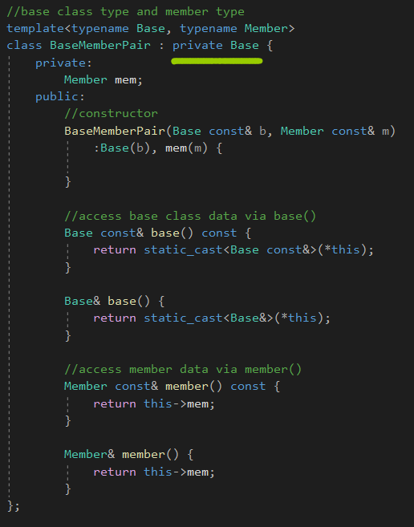

空基类优化。


# The Curiously Recurring Template Pattern(CRTP)


传递一个派生类作为模板参数到一个它的基类里面。


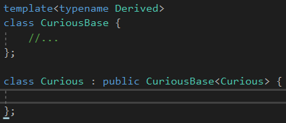

这里Curious不是一个模板。


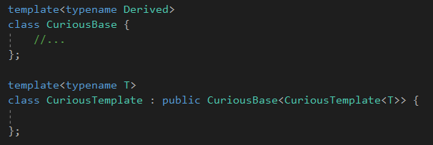

通过传递派生类到它的基类通过一个模板参数，基类可以自定义它的行为到派生类，不需要使用虚函数。


CRTP的一个简单应用就是一个类类型有多少对象被创建。

这个是很容易实现的，通过一个静态数据成员，在构造函数里面增加，在析构函数里面减少。


实现这个功能通过一个单一的基类会混淆对象的数量对于不同的派生类。

意思应该是指，是把这个加减放在派生类好，还是基类好。

相反，我们可以写成如下的形式：

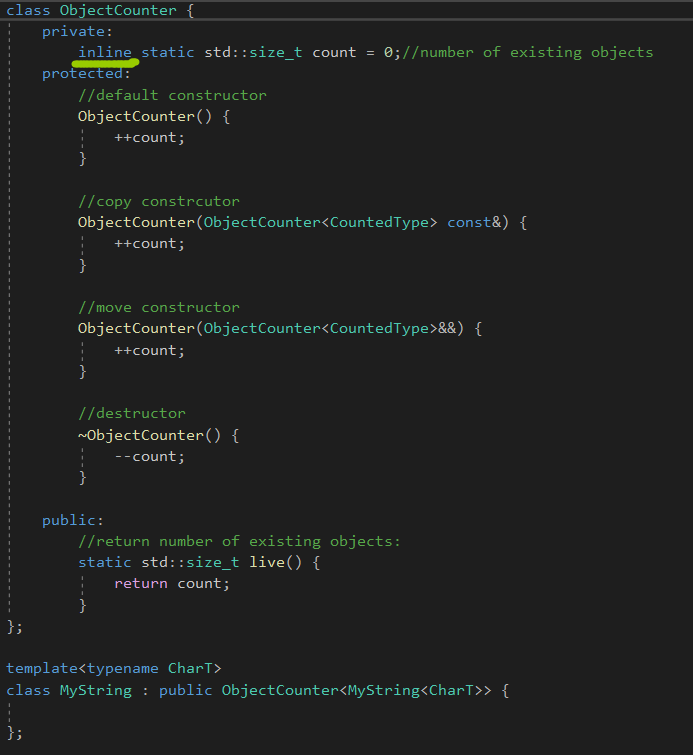

在C++17之前，静态数据成员还需要在外面再定义一次。


# The Barton-Nackman Trick

1994年，John J.Barton和Lee R.Nackman展示了一个模板技术，叫做受限制的模板扩展。

这个技术的动机来自于一个事实-在那时-函数模板重载严重受到限制并且命名空间在大多数编译器上不能使用。


为了解释这个，考虑一个类Array，假设我们想定义它的一个==成员函数，**一个可能的操作是声明该操作符作为类模板的成员。**


但是==应该是个对称的操作，第一个参数不应该是this指针。


倾向于声明它作为一个命名空间函数。

然而，如果函数模板不可以重载，这会产生一个问题：没有其它的operator == 模板可以被声明在那个作用域。

Barton和Nackman解决这个问题通过定义操作符在类里面作为一个普通的友元函数：

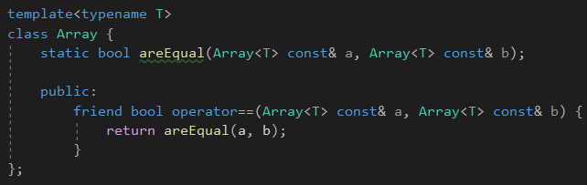

假设Array的这个版本被类型float实例化，友元operator函数那么声明为作为那个实例的结果，

但是这个函数本身不是一个函数模板的实例。


它是一个普通非模板函数，被注入到全局作用域里，作为实例化过程的副作用。

因为它是一个非模板函数，它可以被其它操作符==的声明重载。


**同时，它可以访问私有数据成员，通过调用静态函数。**


Barton和Nackman叫这个为restricted template expansion，**因为它避免了一个模板operator==(T, T)应用到所有的类型T。**


因为

```c++
operator == (Array<T> const&, Array<T> const&);
```

被定义在一个类定义里面，它隐式地被考虑为一个内联函数，并且我们因此决定去委托实现到一个静态成员函数areEqual上，这个不需要内联。


自从1994年，友元函数定义的名字查找已经发生了变化。Barton-Nackman trick在标准C++中不再有效。

在其发明时，当通过一个名为友元注入的过程建立一个类模板时，**友元声明将在该类模板的封闭范围内可见。**

标准C++代替查找友元函数声明通过参数依赖查找。


这意味着函数调用的至少一个参数必须**已经将包含友元函数的类作为关联类**，比如Wrapper&lt;T&gt;就是一个包含友元声明的类。

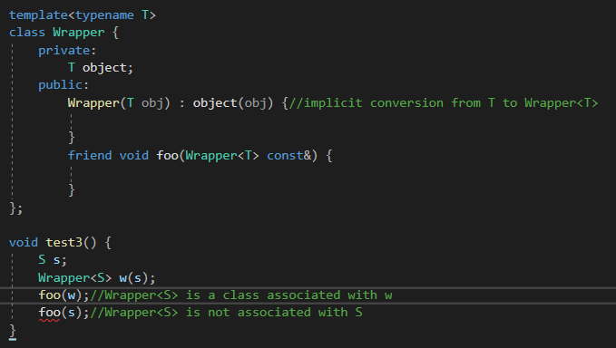

foo(w)是有效的，因为函数foo()是一个友元声明在Wrapper&lt;S&gt;里面，它是一个关联到参数w的类。

而foo(s)是错误的，因为foo(Wrapper&lt;S&gt; const&)没有关联到类型S的参数s上。

候选者函数foo()没有被第一个地方发现，因为没有实例化的缘故，**没有实例化出这个普通的函数。**

即使有一个隐式转换，也不行，但是Barton-Nackman Trick可以解决这个问题。


# Operator Implementations


当实现一个类，提供重载的操作符，它是通用的去提供重载，对于一些数量不同的操作符。


多数情况下，这些操作符中的一个是定义是感兴趣的，其余的定义都可以只根据这一个简单地定义。

```c++
bool operator != (X const& x1, X const& x2)
{
	return !(x1 == x2);
}
```

它根据==操作符进行定义。


给定大量类型，和相似的定义!=，企图概括这个到一个模板：

```c++
template<typename T>
bool operator!=(T const& x1, T const& x2)
{
	return !(x1 == x2);
}
```


事实上，C++标准库包含一个相似的定义作为&lt;utility&gt;的一部分，然而，这些定义被降级到命名空间std::rel_ops里面。

因为会发生一些问题，这些定义会导致所有的类型都有!=操作符，可能会导致实例化失败，

并且操作符将总是精确地匹配它的参数。这个问题可以通过SFINAE解决。

**但是通用的!=将会优于用户的定义，比如，一个派生类向基类的转换，会发生意外。**


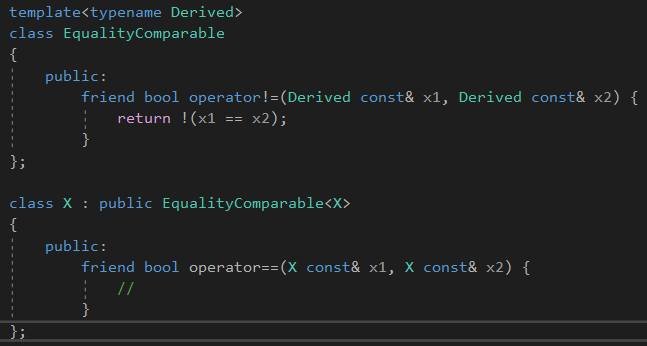

这些操作符的一个可选择的解决方式是通过基于CRTP，允许类去参与进通用的操作符定义，

提供增加的代码的复用的好处，没有过分的通用操作符的负面影响。


基类使用了派生类的等于操作符。


在这里，我们合并了CRTP和Barton-Nackman技巧。它实际上提供了一个定义，通过一个友元函数定义(Barton-Nackman技巧)，

**给予了两个参数到operator != 相等行为，为了转换。**


CRTP可以是非常有用的，当分解行为到一个基类里面，并且保持最终的派生类的一些标识。

和Barton-Nackman技巧，CRTP可以提供通用的定义，对于一定数量的操作符，给予一些典型的操作。


# Facades

外观模式。


使用CRTP和Barton-Nackman trick去定义一些操作符，是一个非常方便的捷径。


CRTP基类定义了一个类的大多数公有接口，**根据一些部分由CRTP派生类暴露出来的接口实现。**


这个模式，叫做门面模式，是非常有用的，当定义一些新的类型，**需要去满足一些已有接口的需求-数值类型，迭代器，容器。**


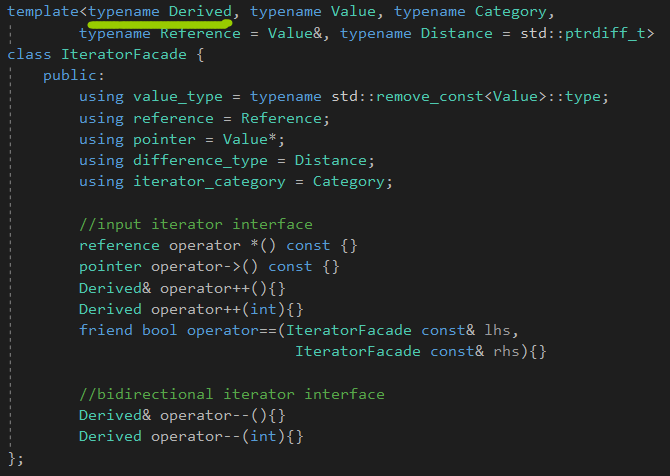

外观模式将迪米特法则和依赖倒置原则运用地非常完美。


实现每一个这些列出的新迭代器是令人厌烦的。幸运地是，接口可以被提取到一些核心操作：

对于所有的迭代器：

```c++
dereference():询问迭代器引用的值

increment():移动迭代器去引用序列中下一个项

equals():决定是否两个迭代器引用同一个项在一个序列中
```


对于双向迭代器：

```c++
decrement():移动迭代器去引用列表中上一个项
```


对于随机访问迭代器：

```c++
advance():移动迭代器前进n步，或者回退
measureDistance():决定要步伐的数量，在序列中，从一个迭代器到另一个迭代器
```


外观模式的原则是适配一个类型，只实现这些核心操作去提供完整的迭代器接口。

IteratorFacade的实现大多数涉及映射接口的语义到最小的接口。

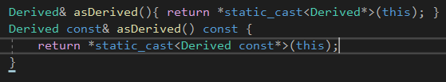

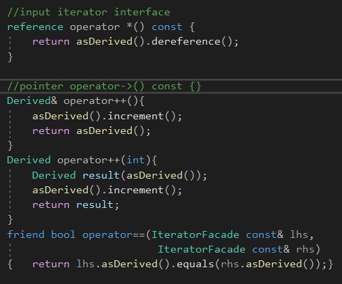

给定这些定义，外观模式的大多数实现是非常直接的。比如上面的。


# Defining a Linked-List Iterator

根据IteratorFacade的定义，我们可以轻松地定义一个迭代器到一个简单的链表类。


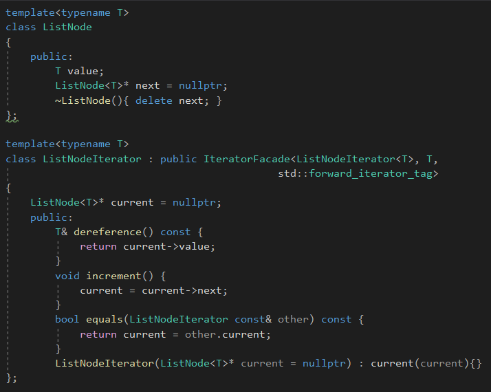

一个简单的链表如上。


# Hiding the interface

ListNodeIterator的实现的一个缺点就是我们需要去暴露，作为一个公共接口，操作dereference()，advance()，还有equals()。


为了消除这个需求，我们可以重构IteratorFacade去执行它的所有操作在派生的CRTP类，通过一个分离的访问类。


叫做IteratorFacadeAccess：

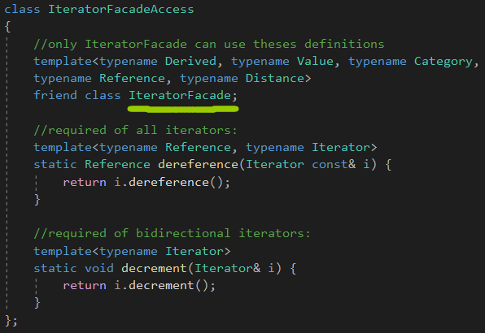

只有IteratorFacade可以调用这些静态数据成员。

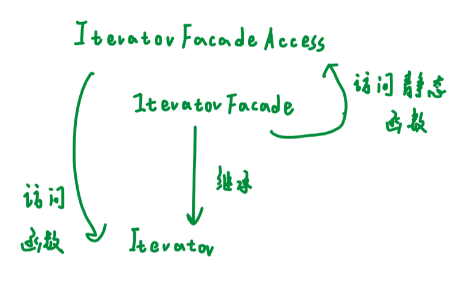

现在，迭代器Iterator可以全是private的接口了。


# Iterator Adapters

将一个接口变为另一个接口。


我们的IteratorFacade使得它容易去构建一个Iterator Adapter，使用一个已经存在的接口并且暴露一个新的接口，提供潜在序列的一些转换视角。

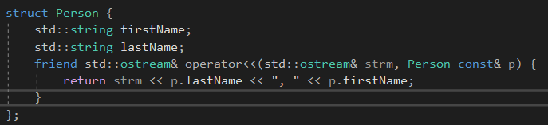

比如，我们想修改现有的接口，变成只输出第一个成员。


ProjectionIterator是一个迭代器定义，基于基类迭代器，并且值的类型会被T暴露出来。

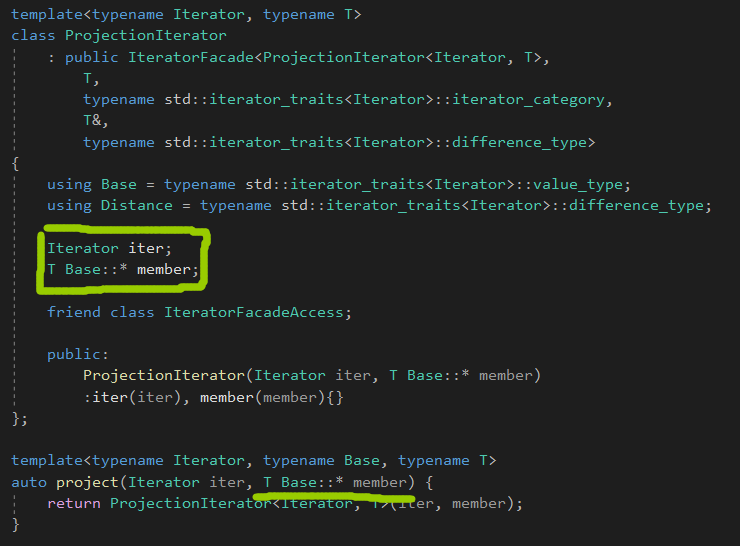

member，一个指向数据的成员，描述了哪个成员要投影。


原先ProjectionIterator&lt;Iterator, T&gt;这里填Iterator的。


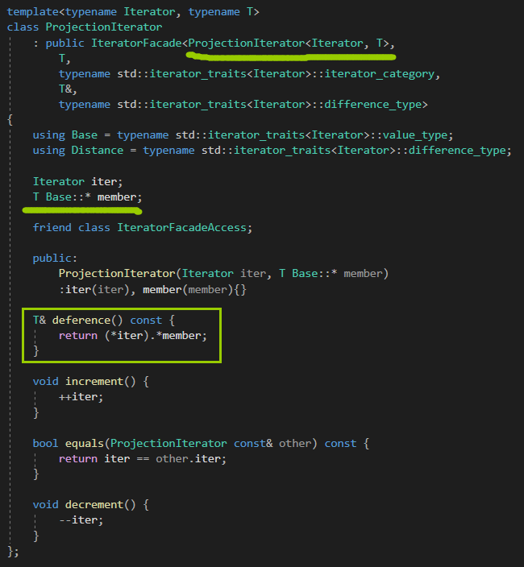

相当于现在IteratorFacade访问的是ProjectionIter的接口，而ProjectionIter来调用Iterator的接口，并且任意的访问，改造。

projectionIter接管了Iterator的操作，所以要获取Iter。

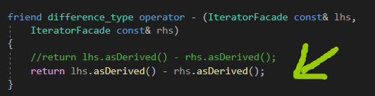

IteratorFacade实现这个接口，调用派生类的接口。


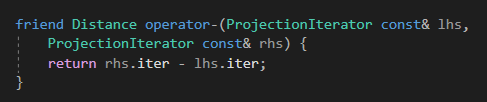

ProjectionIterator现在实现这个接口。


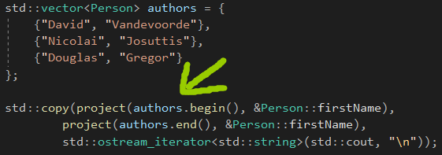

把vector的iterator映射为我们的projectionIterator，这样就能打印首个成员了。


# Mixins

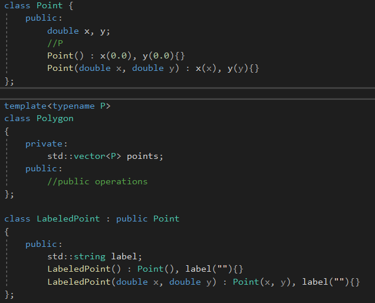

如果我们想扩展Point，有些缺点，要求类型Point暴露给用户，用户才可以从Point那里继承。

LabelPoint的作者要小心地去提供和Point同样的接口。


如果Point修改了，那么LabelPoint的构造函数可能也需要更新。


Mixins提供一种选择的方式，去自定义类型的行为，不需要继承它。

Mixin倒转了继承的方向，因为新的类混合到继承层次里面作为基类，而不是创建一个新的派生类。


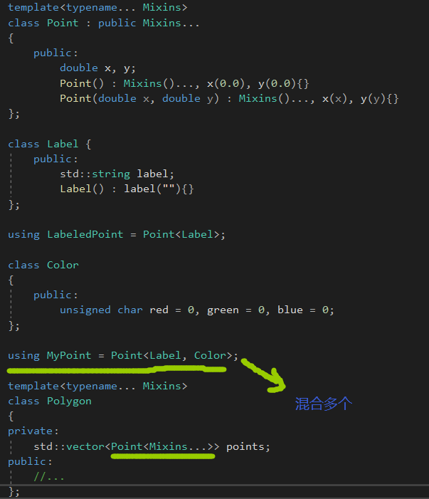

用户只需要从Point转换成Mixins基类即可。


## Curious Mixins

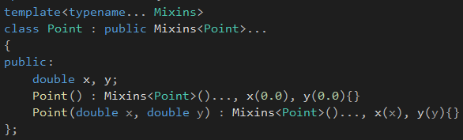

Mixins可以搭配CRTP，但是Mixins类需要是模板类，这样Mixins就能访问派生类的东西。


## Parameterizaed Virtuality


参数化的虚拟性。


Mixins允许间接地参数派生类的其它属性，例如成员函数的虚拟性。

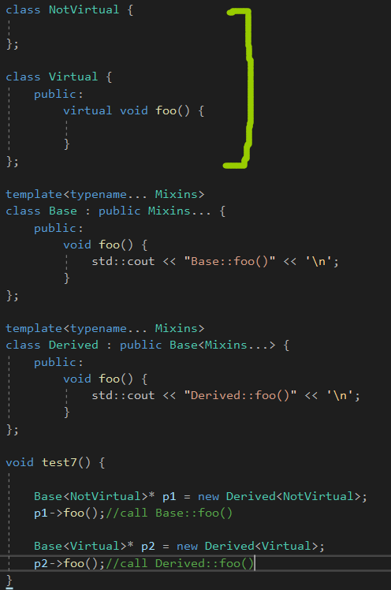

控制虚拟性。


这个技术可以提供一个工具去设计一个类模板，非常有用地去实例化具体的类或者去扩展使用继承。


## Named Template Arguments

指定模板参数。


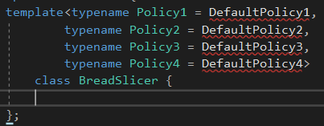

如果能指定模板参数，而不用为了一个模板参数，把前面的全写出来，就好了。

```C++
BreadSlicer<Policy3 = Custom>
```


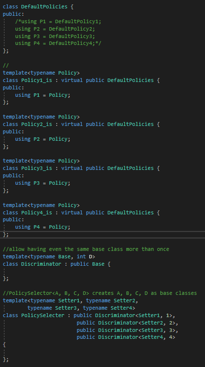

Policy1_is&lt;自定义的策略&gt;传入PolicySelector的模板参数。


可以这样使用：

```C++
template<typename PolicySetter1 = DefaultPolicyArgs,
		typename PolicySetter2 = DefaultPolicyArgs,
		typename PolicySetter3 = DefaultPolicyArgs,
		typename PolicySetter4 = DefaultPolicyArgs>
class BreadSlicer{
	using Policies = PoliySelector<PolicySetter1, PolicySetter2,
								PolicySetter3, PolicySetter4>;
	//using Policies::P1 to refer to the various policies
};
```


