# Bridging Static and Dynamic Polymorphism

桥接静态和动态多态性。


静态多态性的缺点就是集合的类型必须在编译期间就决定。


桥接静态和动态多态在C++中。


# Function Objects, Pointers, and std::function<>

函数对象是有用的，对于提供自定义的行为到模板。


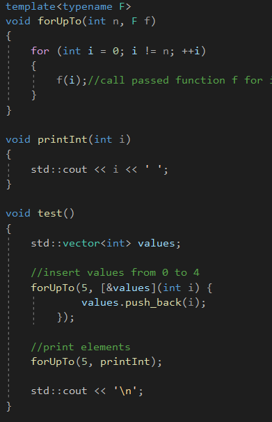

forUpTo()函数模板可以被用于任何函数对象，包括lambda，函数指针，或者任何类，实现了一个合适的operator()。


使用forUpTo()会导致实例化膨胀，代码数量会增多。


一种解决方法就是将函数模板变成非函数模板，如果参数是函数指针，那么就无法传入Lambda。


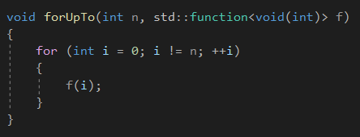

forUpTo提供了静态多态性的视角，能够与函数指针，lambdas，一个有operator()的类型进行工作。

但是它本身保留了一个非模板函数，使用一个单一的实现。


它使用了一种技术叫做类型擦除，桥接了静态和动态多态性。


# Generalized Function Pointers

广义函数指针。


std::function<>类型可以拷贝，移动，并且赋值。

它可以初始化或者赋值从另一个函数(一个兼容的签名)。

它有一个"null"状态，表示没有函数绑定到它。


不像C++函数指针，std::function&lt;&gt;可以存储一个lambda或者任何其它的函数对象，使用一个合适的operator()。

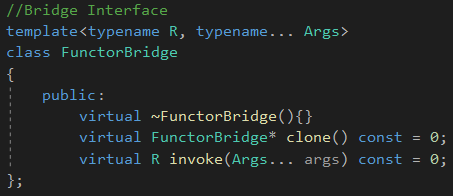

FunctorBridge类模板负责潜在的函数对象的所有权和操控。

它被实现为一个抽象基类，执行FunctionPtr的动态多态性。一个析构函数，一个clone()操作去执行拷贝，

还有invoke()，操作去调用潜在的函数对象。


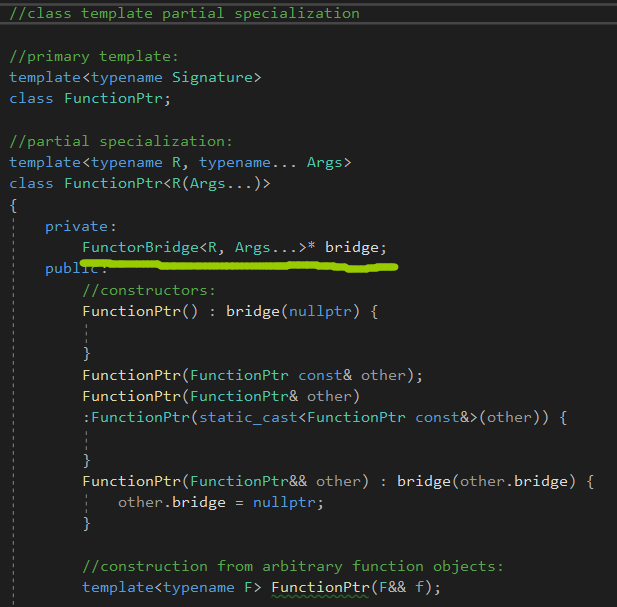

这个实现包含一个非静态的成员变量，bridge，负责存储和操控存储的函数对象。

指针的所有权被关联到FunctionPtr对象，所以大部分的实现都管理这个指针有关。


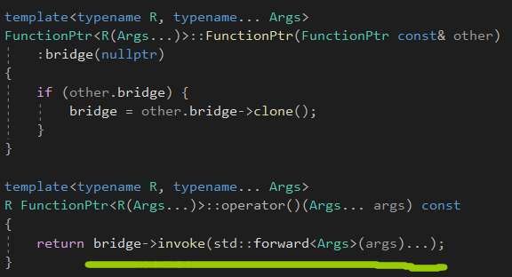

动态多态性，虚函数，**调用FunctorBridge的子类的虚函数。**


# Type Erasure


我们需要一个未绑定数量的派生类。

幸运地是，我们可以实现这个，通过参数化派生类，在它存储的函数对象的类型上：

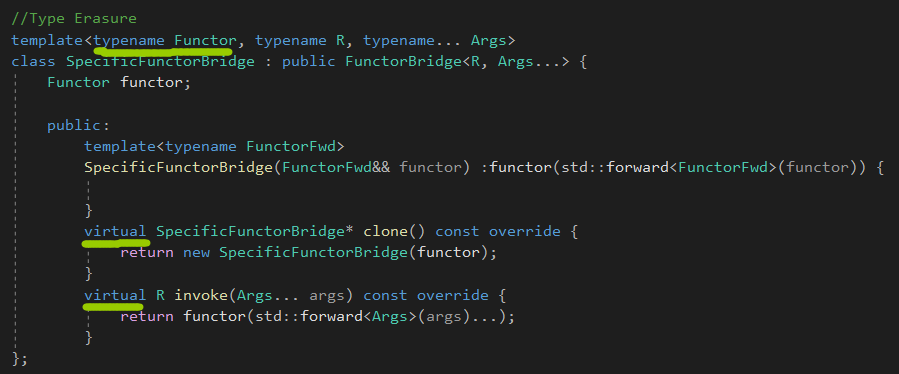

SpecificFunctorBridge存储函数对象的一份拷贝(类型是Functor)，可以被调用，被拷贝，或者销毁。


SpecificFunctorBridge实例被创建，无论何时一个FunctionPtr被初始化为一个新函数对象，完整的FunctiorPtr例子如下：

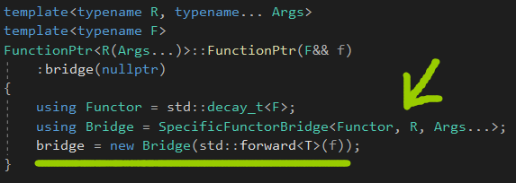

一旦新的分配的Bridge实例被赋值给数据成员bridge，额外关于F的信息会丢失，由于派生类向子类的转换，

从Bridge到FunctorBridge<R, Args...>*。


# Optional Bridging

可选的桥接。


我们缺少一个被函数指针提供的操作：测试是否两个FunctionPtr对象调用同样的函数。

添加这样一个操作需要更新FunctorBridge一个equals操作：

```c++
virtual bool equals(FunctorBridge const* fb) const = 0;
```


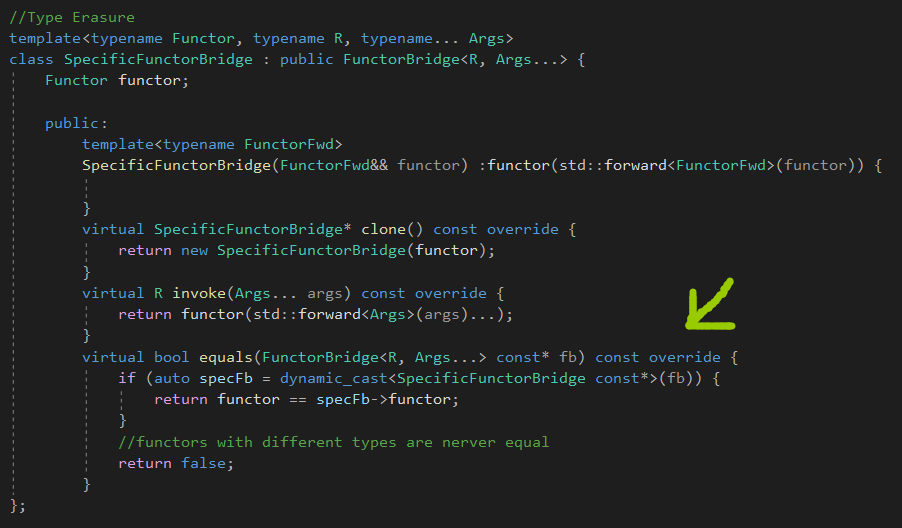

实现接口。

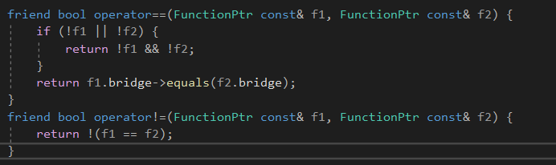

有个小小的问题，如果FunctionPtr被赋值或者初始化的函数对象没有一个合适的==，那么程序就会编译失败。

就算没有用，也会报错。


这个问题产生的原因是类型擦除，因为我们丢失了函数对象的信息，一旦FunctionPtr已经被赋值或者初始化。

我们需要知道类型的所有信息在赋值和初始化之前。然后使用SFINAE trait去询问操作符==是否能够使用。

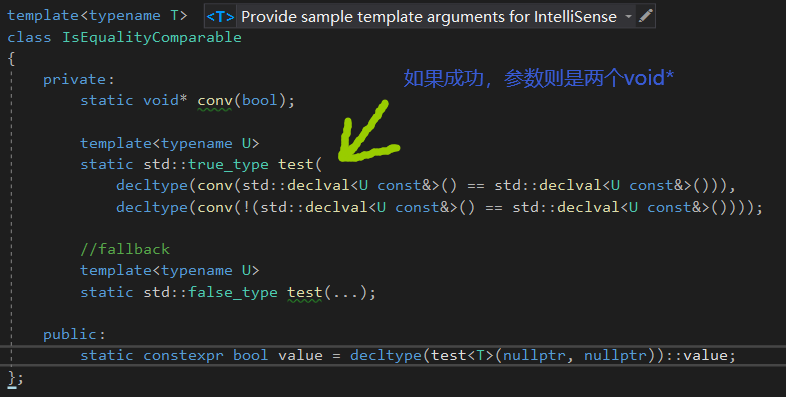

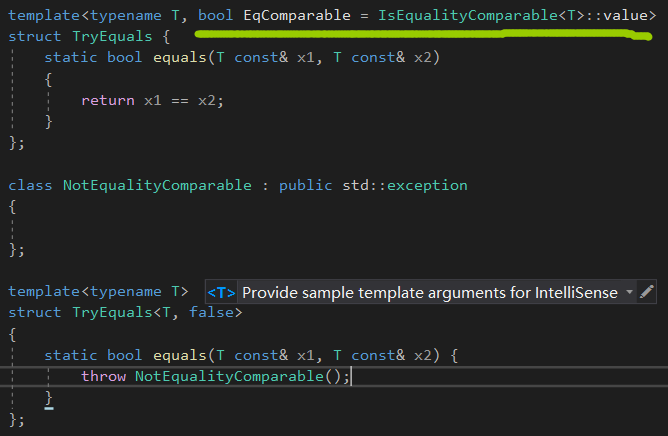

使用IsEqualityComparable trait，我们可以构造一个TryEquals类模板，可以要么调用==在一个给定的类型，

或者抛出一个异常，如果没有合适的==存在。


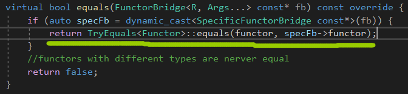

改良的版本。


