# Metaprogramming


元编程的意思是用代码生成代码。


Metaprogramming依赖traits和类型函数，第19章的内容。


# Value Metaprogramming

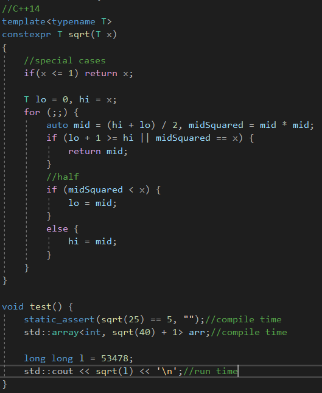

值元编程(编程计算编译期间的值)。


还有类型元编程和混合元编程。


# Type Programming


第19章，获取一个类型作为输入并且从那里产生一个新类型。

例如，RemoveReferenceT类模板计算了一个引用类型的潜在类型。


使用递归模板实例化。


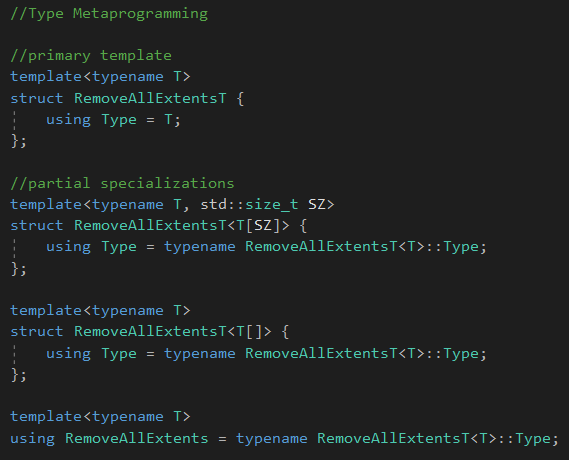

RemoveAllExtents是一个类型元函数。


Typelist&lt;...&gt;是类型容器。


# Hybrid Metaprogramming


使用值元编程和类型元编程，我们可以计算值和类型在编译期间。


我们可以在编译期间对代码进行组装，从而产生运行时效果。


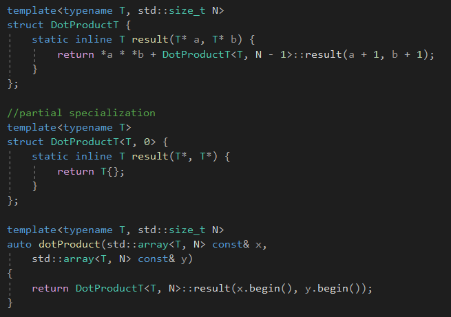

计算两个数组的点积。


使用递归模板实例化，外加部分特例化去终止递归。


这里会有N个主模板的实例，以及1个终止特例化的实例。

为了高效率，每个函数都是static的。


混合元编程的英雄容器是tuple，tuple是值的序列，每个都是选定的类型。


# Hybrid Metaprogramming for Unit Types


计算不同单位类型的两个值的结果。


值的计算在运行期间，结果单位被决定在编译期间。


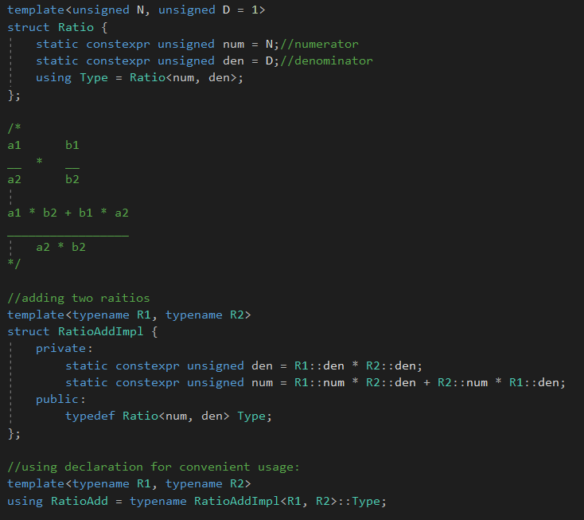

计算类型如上。


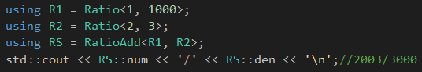

使用如上。


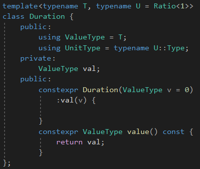

持续时间，参数化值的类型，和单位的类型。


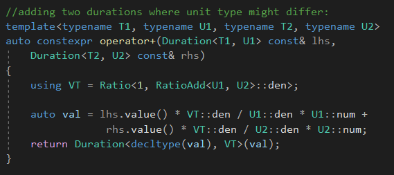

将两个不同单位的持续时间加起来的。


混合的效果是编译器决定结果的单位类型在编译期间，并且生成代码在运行期间计算值。


C++标准库的std::chrono使用这种方式，并且有一些预定义的单位，比如std::chrono::milliseconds。


# The Dimensions of Reflective Metaprogramming


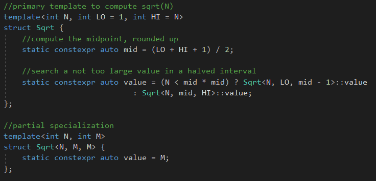


我们喜欢去思考一个综合的元编程解决方案，对于C++，必须做出的决策，有三个维度：

1.计算

2.反射

3.生成


反射是指有能力去编程化地观察程序的能力。

生成倾向于生成额外的代码，对于程序来说。


计算有两种方式：递归实例化和constexpr求值。对于反射，我们找到了部分解决方法在类型traits上(第19章)。


递归实例化消耗大量的资源，直到编译完成后才释放掉。


# The Cost of Recursive Instantiation


模板实例化不是便宜的。


# Tracking All Instantiations

```c++
(16 <= 8 * 8) > Sqrt<16, 1, 8>::value
:Sqrt<16, 9, 16>::value;
```


它的实例化不仅正的分支会实例化，负的分支也会实例化。


**因为代码其它访问它的成员value**，所有在那个类里面的成员都会被实例化。

因此Sqrt&lt;16, 9, 16&gt;的实例化会导致Sqrt&lt;16, 9, 12&gt;和Sqrt&lt;16, 13, 16&gt;的完整实例化。

数量是2 * N。


这里有技术，可以减少实例化数量的爆炸。

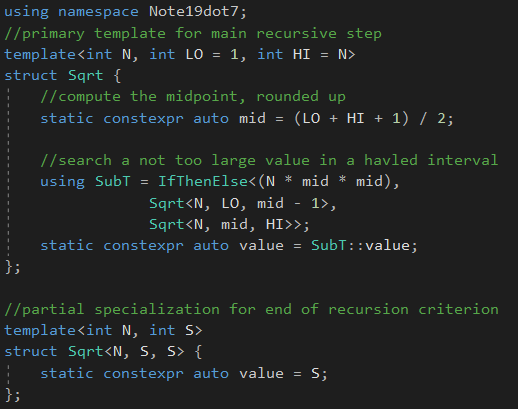

关键的改变，是这里使用IfThenElse模板。


**因为访问成员，才导致完整的实例化的。**


IfThenElse模板是一个设施，在两个类型之间选择，基于一个给定的布尔常量。

需要注意一点的是，定义一个类模板的别名模板，不会造成C++编译器去实例化那个实例。


```c++
using SubT = IfThenElse<(N < mid * mid),
			Sqrt<N, LO, mid - 1>,
			Sqrt<N, mid, HI>>;
```


两个分支都不会实例化。当查询SubT的时候，才会实例化。


相对于第一种解决方案，实例化的数量到达
$$
log_2(N)
$$

# Computational Completenes

Sqrt&lt;&gt;例子证明了一个模板元编程可以包含：

1.状态变量：模板参数

2.循环结构：通过递归

3.执行路径选择：使用条件表达式或者特例化

4.整型算术


# Enumeration Values versus Static Constants

枚举值对比静态常量


在早期的C++，枚举值是唯一的机能去创建真正的常量作为有名的成员在类声明里面。

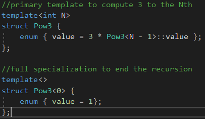

C++98引入了静态常量初始化的概念，Pow3元编程可以像下面那样：

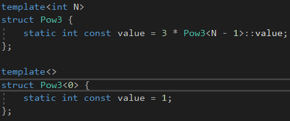

然而，这样会有个缺点，静态常量成员是左值，我们有个声明长这样：

````c++
void foo(int const&);
````


我们传递Pow3的结果到这个函数里面：

```c++
foo(Pow3<7>::value);
```


一个编译器必须传递Pow3&lt;7&gt;::value的地址，并且强迫编译器去实例化和分配静态成员的定义。

作为结果，计算不再限制于一个纯净的编译期间效果。


枚举值不是左值，当我们传递它的引用，没有静态内存被使用，就像传递一个字面值一样。


C++11，引入constexpr静态数据成员，不再受限于整型。但是没有解决上面地址的问题。

C++17的inline解决了地址的问题。


