# Typelists


对于类型元编程，中心数据结构是typelist。是一个包含类型的列表。


# Anatomy of a Typelist

分析一个Typelist。


typelist是一个类型，表示类型的一个列表，并且可以被模板元编程操作。


它提供了经典的操作关于一个列表的，迭代元素(types)在列表中，添加元素，或者移除元素。


它和std::list的区别是，它无法改变，添加一个类型到typelist中，不会改变原先的类型，

相反，添加一个元素到一个已经存在的typelist里面，会创建一个新的typelist，不需要修改原先的。


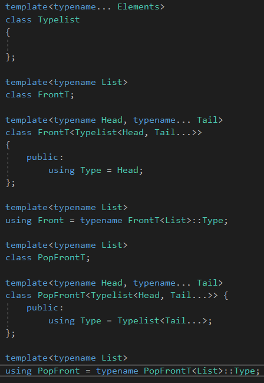

Typelist<>表示一个空的类型列表。


包含int，Typelist&lt;int&gt;。


# Typelist Algorithms

## Indexing

```c++
using TL = NthElement<Typelist<short, int, long>, 2>;
```

抽取第二个元素。


NthElement操作被实现起来，使用一个递归模板元编程，遍历typelist，直到找到要求的元素：

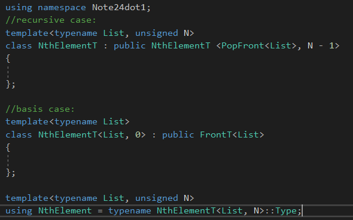

注意，我们的最后一个情况，是继承FrontT&lt;List&gt;，间接拥有了Type成员。


## Finding the Best Match

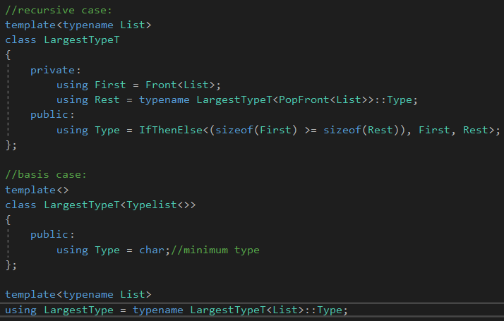

LargestType算法会找出第一个，最大的类型，在typelist中。


注意，基本的情况显式地提出了空typelist，Typelist<>。这有时候不幸的，因为它阻碍了使用了其它形式的typelist。


解决方法：

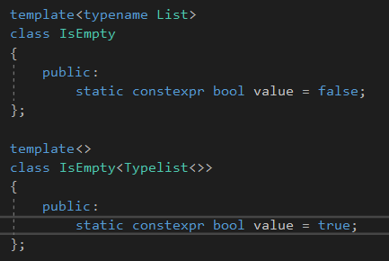

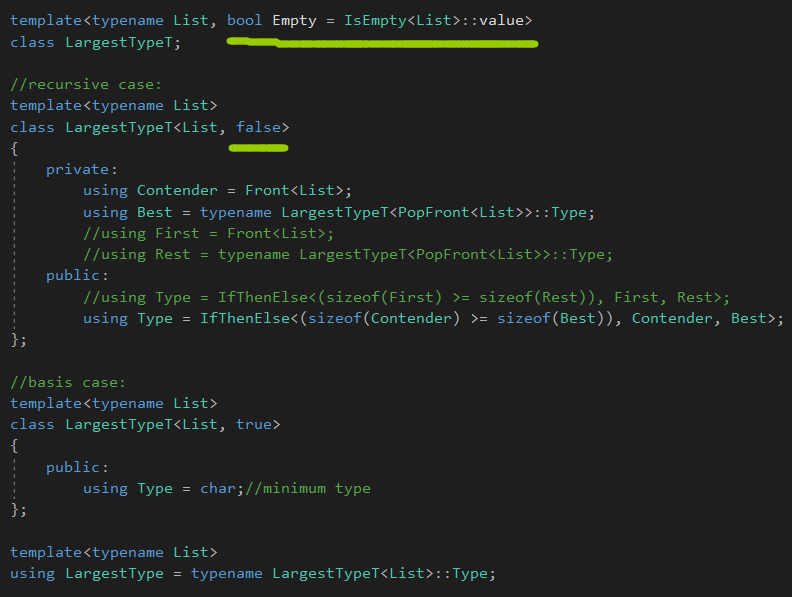

解决方式如上，绿色的是增加的。


LargestTypeT的默认第二个模板参数，Empty，检查列表是否为空的。


## Appending to a Typelist

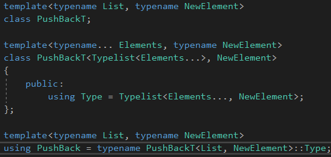

和PushFrontT一样简单。


我们可以实现一个普遍的算法，对于PsuhBack，仅仅使用基本的操作Front，PushFront，PopFront，还有IsEmpty。


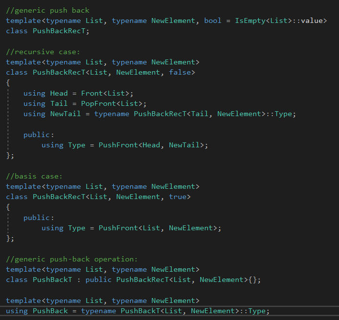

还是第一个版本的效率高，**这个版本会产生很多的实例化版本。**


 ## Reversing a Typelist

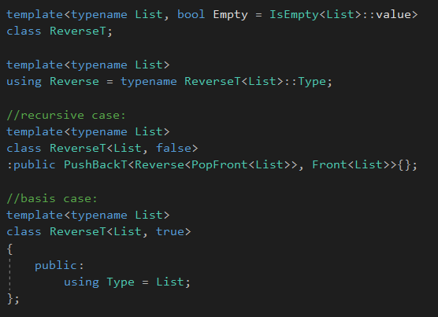

如果给定Typelist&lt;short, int, long&gt;，递归步骤分离了第一个元素short从剩余的冤死(Typelist&lt;int, long&gt;)。

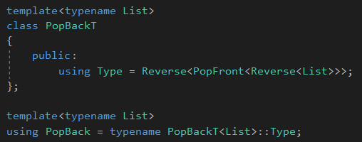

使用Rervese，可以很轻松地实现PopBackT。


## Transforming a Typelist


我们想转换所有的types到typelist在一些方式上，例如，把每个类型变成const修饰的variant，使用AddConst元函数。

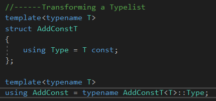

我们会实现一个Transform算法，使用一个typelist和一个元函数，并且产生另一个typelist，包含应用了metafunction到每个type的结果。


比如：

```c++
Transform<SignedIntegralTypes, AddConstT>
```


元函数被提供，通过一个模板模板参数，映射一个输入类型到一个输出类型。

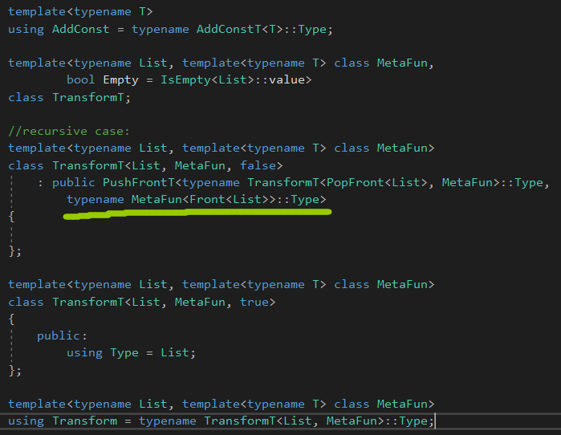

这里的MetaFun就相当于传入函数的函数指针。


这里的逻辑是取出一个类型，转换完毕后，再压回前面。


## Accumulating Typelists


Accumulate采用一个typelist T，和元素T1，T2，...，TN，一个初始类型I，还有一个元函数F，

元函数F接收两个类型和返回一个类型。


如果F选择两个类型中最大的，Accumulate将表现起来像LargestType算法。

如果F接收一个TypeList和一个type，并且压入type到typelist的最后，Accumulate将表现起来像Reverse算法。


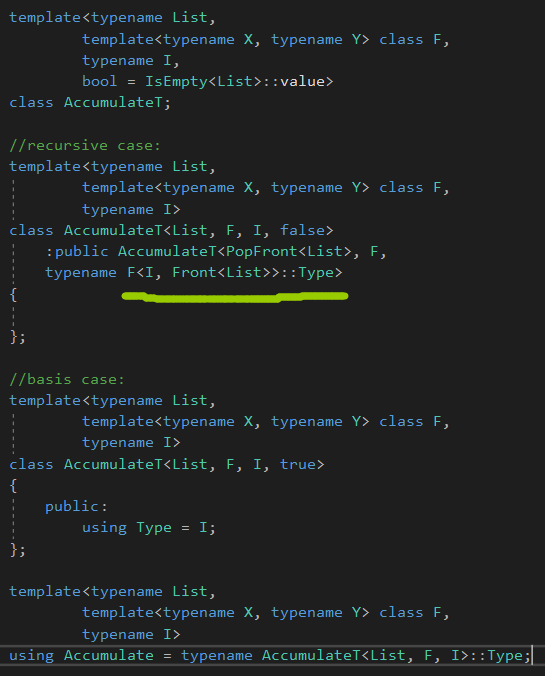

初始类型I被用来作为累加器，捕获现在的结果。


因此，basis case返回这个结果，当它到达typelist的结尾。


使用Accumulate，我们可以翻转一个typelist，使用PushFrontT作为元函数F，并且一个空typelist(TypeList&lt;T&gt;)作为初始的类型I：

```c++
using Result = Accumulate<SignedIntegralTypes, PushFrontT, Typelist<>>;
//produce TypeList<long long, long int, int, short, signed char>
```


实现一个基于Accumulator版本的LargestType，LargestTypeAcc需要更多的努力，我们需要产生一个元函数，返回两个类型的最大值：

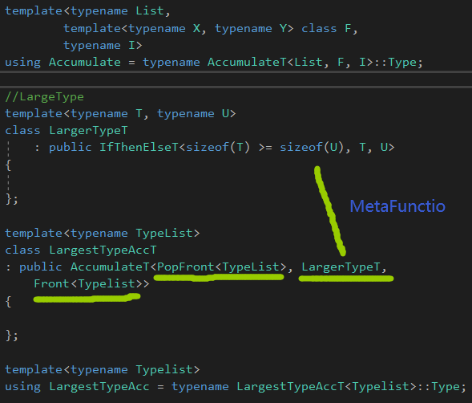

LargestType需要一个非空typelist，因此提供typelist的第一个元素作为初始的类型。


我们可以显式地处理空的list，可以返回一些哨兵类型(char 或者 void)，或者使得算法本身SFINAE友好地。

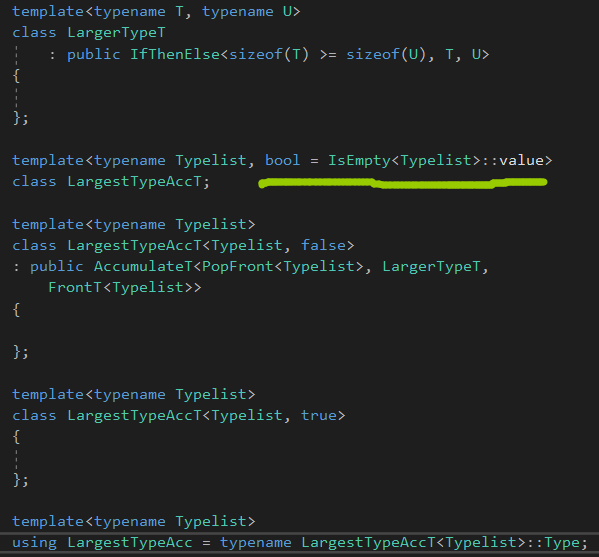

SFINAE友好地，处理了为空的情况。


## Insertion Sort

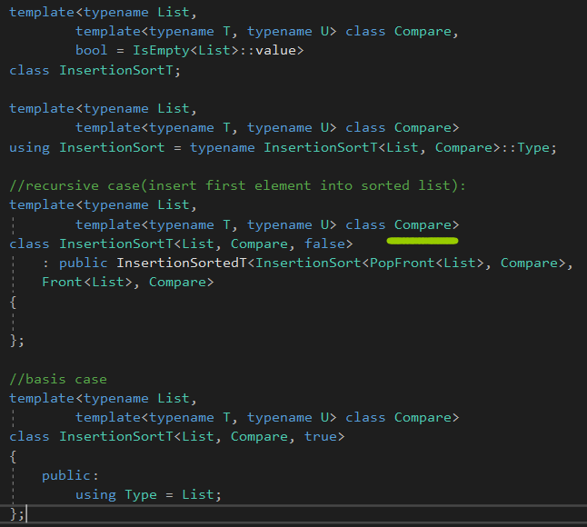

Compare用来排序typelist里面的元素。

它接收两个类型，并且求出一个布尔值，通过它的value成员。basic情况，就一个空的typelist。


核心插入排序是InsertSortedT元函数，使用第一个元素插入到已经排好序的list里面。


想递归的时候，把InsertionSort看成已经排序后的List。


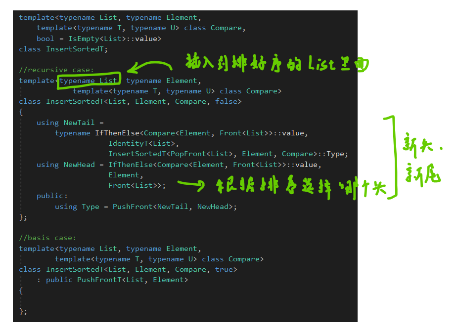

这个实现包含了编译期间的优化去避免实例化不会用到的类型。


Identity生成了未修改的List。


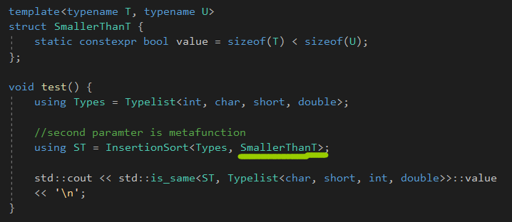

传进去一个metafunction。


