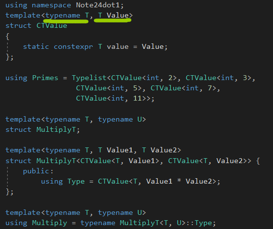
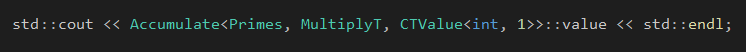
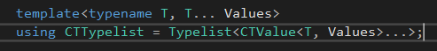
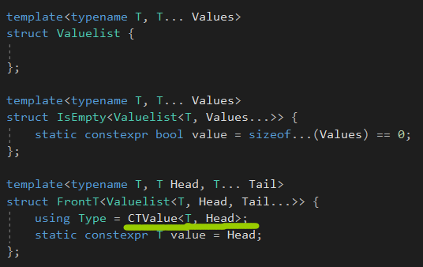
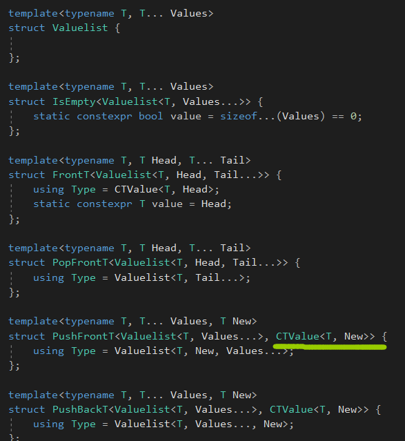
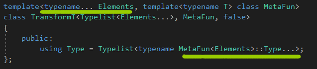
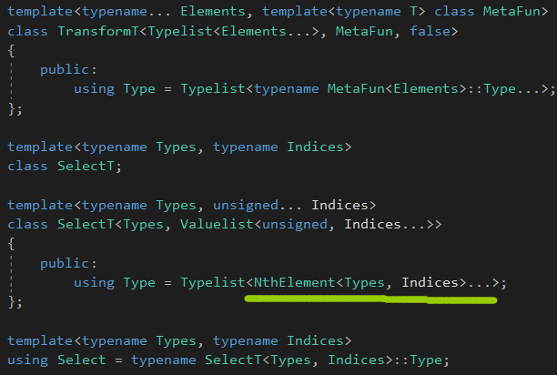
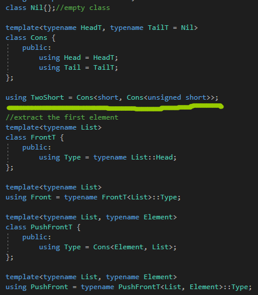
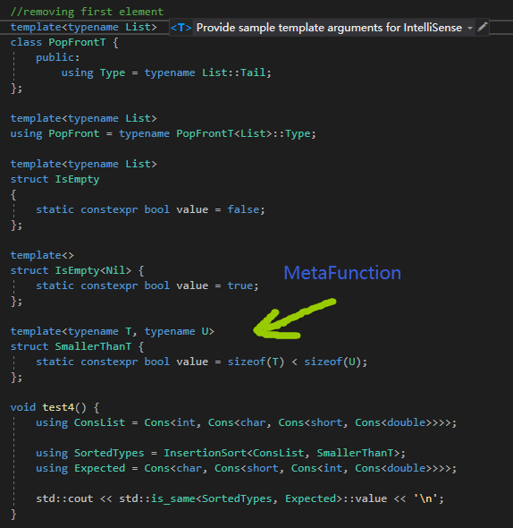

# Typelists


对于类型元编程，中心数据结构是typelist。是一个包含类型的列表。


# Anatomy of a Typelist

分析一个Typelist。


typelist是一个类型，表示类型的一个列表，并且可以被模板元编程操作。


它提供了经典的操作关于一个列表的，迭代元素(types)在列表中，添加元素，或者移除元素。


它和std::list的区别是，它无法改变，添加一个类型到typelist中，不会改变原先的类型，

相反，添加一个元素到一个已经存在的typelist里面，会创建一个新的typelist，不需要修改原先的。


Typelist<>表示一个空的类型列表。


包含int，Typelist&lt;int&gt;。


# Typelist Algorithms

## Indexing

```c++
using TL = NthElement<Typelist<short, int, long>, 2>;
```

抽取第二个元素。


NthElement操作被实现起来，使用一个递归模板元编程，遍历typelist，直到找到要求的元素：


注意，我们的最后一个情况，是继承FrontT&lt;List&gt;，间接拥有了Type成员。


## Finding the Best Match


LargestType算法会找出第一个，最大的类型，在typelist中。


注意，基本的情况显式地提出了空typelist，Typelist<>。这有时候不幸的，因为它阻碍了使用了其它形式的typelist。


解决方法：


解决方式如上，绿色的是增加的。


LargestTypeT的默认第二个模板参数，Empty，检查列表是否为空的。


## Appending to a Typelist


和PushFrontT一样简单。


我们可以实现一个普遍的算法，对于PsuhBack，仅仅使用基本的操作Front，PushFront，PopFront，还有IsEmpty。


还是第一个版本的效率高，**这个版本会产生很多的实例化版本。**


 ## Reversing a Typelist


如果给定Typelist&lt;short, int, long&gt;，递归步骤分离了第一个元素short从剩余的冤死(Typelist&lt;int, long&gt;)。


使用Rervese，可以很轻松地实现PopBackT。


## Transforming a Typelist


我们想转换所有的types到typelist在一些方式上，例如，把每个类型变成const修饰的variant，使用AddConst元函数。


我们会实现一个Transform算法，使用一个typelist和一个元函数，并且产生另一个typelist，包含应用了metafunction到每个type的结果。


比如：

```c++
Transform<SignedIntegralTypes, AddConstT>
```


元函数被提供，通过一个模板模板参数，映射一个输入类型到一个输出类型。


这里的MetaFun就相当于传入函数的函数指针。


这里的逻辑是取出一个类型，转换完毕后，再压回前面。


## Accumulating Typelists


Accumulate采用一个typelist T，和元素T1，T2，...，TN，一个初始类型I，还有一个元函数F，

元函数F接收两个类型和返回一个类型。


如果F选择两个类型中最大的，Accumulate将表现起来像LargestType算法。

如果F接收一个TypeList和一个type，并且压入type到typelist的最后，Accumulate将表现起来像Reverse算法。


初始类型I被用来作为累加器，捕获现在的结果。


因此，basis case返回这个结果，当它到达typelist的结尾。


使用Accumulate，我们可以翻转一个typelist，使用PushFrontT作为元函数F，并且一个空typelist(TypeList&lt;T&gt;)作为初始的类型I：

```c++
using Result = Accumulate<SignedIntegralTypes, PushFrontT, Typelist<>>;
//produce TypeList<long long, long int, int, short, signed char>
```


实现一个基于Accumulator版本的LargestType，LargestTypeAcc需要更多的努力，我们需要产生一个元函数，返回两个类型的最大值：


LargestType需要一个非空typelist，因此提供typelist的第一个元素作为初始的类型。


我们可以显式地处理空的list，可以返回一些哨兵类型(char 或者 void)，或者使得算法本身SFINAE友好地。


SFINAE友好地，处理了为空的情况。


## Insertion Sort


Compare用来排序typelist里面的元素。

它接收两个类型，并且求出一个布尔值，通过它的value成员。basic情况，就一个空的typelist。


核心插入排序是InsertSortedT元函数，使用第一个元素插入到已经排好序的list里面。


想递归的时候，把InsertionSort看成已经排序后的List。


这个实现包含了编译期间的优化去避免实例化不会用到的类型。


Identity生成了未修改的List。


传进去一个metafunction。


# Nontype Typelists

这里有几种方式去创建一个编译期间值的typelist。

一个简单的方式参与进来，定义一个CTValue类模板(也叫做编译期间的value)，表示一个确切类型的值，在一个typelist中。



模板参数是值的类型和值。




第一个是Typelist，第二个是MetaFunction，接收两个类型，产生一个新类型，第三个是初始类型。




这种可以简化写法：

```c++
using Primes = CTTypelist<int, 2, 3, 5, 7, 11>;
```


这种方式的负面是别名模板只是别名，错误消息会打印潜在的CTValueTypes的的Typelist，以至于导致它们变得太过冗长。

为了解决这个问题，我们可以创建一个完整的新的typelist类，Valuelist，**直接地存储值。**




CTValue用来存储一个值。这里CTValue没亮，是因为和其它命名空间产生冲突了，而且每个类模板都需要一个主模板。




存放的时候，先构造一个类型CTValue，然后再合并。


使用这个，可以搭配元函数，传入InsertionSort，进行比较排序。


## Deducible Nontype Parameters

可推导的非类型参数。

在C++17，CTValue可以被提升为使用一个单一的，可推导的非类型参数。

```c++
//C++17

template<auto Value>
struct CTValue
{
	static constexpr auto value = Value;
};
```


# Optimizing Algorithms with Pack Expansions

使用包扩展来优化算法。


包扩展是非常有用的机能对于卸下typelist迭代器的任务到编译器。




应用MetaFun到每个Elements上。


这种实现相当简单，它不需要递归并且使用语言特性在一个非常直接的方式上。

它只需要少量的实例化。


包扩展是非常有用的，去选择给定索引的列表中的元素，去生成一个新的typelist。

Select metafunction输入一个typelist和一个包含索引的Valuelist到那个typelist中。

生成一个新的typelist包含Valuelist指定的元素。



直接一个包扩展迭代过去。


一个非类型typelist包含索引到另一个list的，叫做index list。


# Cons-style Typelists


cons-style暂时不知道什么意思，是一种风格的Typelist。


每个cons cell包含一个值(list的头)，一个内嵌的list，后者是另一个cons cell或者一个empty list，nil。



写法是这样子的。然后定义一些类型函数进行获取。




还是使用可变参数模板好一些，首先是不用写太长，其次是可以进行优化。


