homogeneous adj.同质的


tuple的元素通过位置来引用，而不是通过元素的名字。


在编译期间决定tuple的类型，在运行期间进行操控。


我们可以通过metafunction来存储类型的集合到tuple中。


# Basic Tuple Design

## Storage

Tuple存储每个类型在模板参数列表中。


设计思路是将一个元素个数大于0的Tuple，比如Tuple<int, double, std::string>

**看成是int和一个Tuple<double, std::string>。**


Tuple&lt;std::string&gt;可以看作是Tuple<>和std::string。

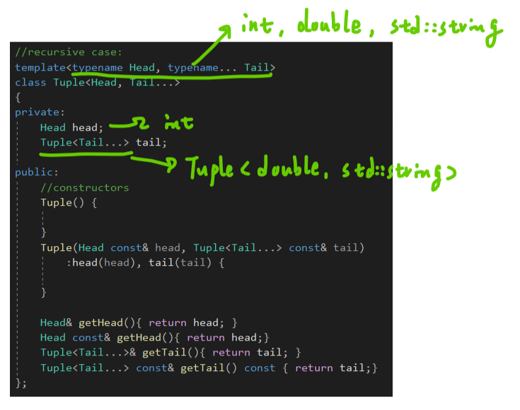

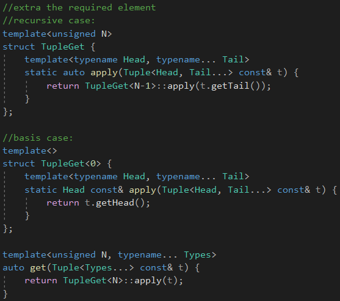

这里使用了类模板的特例化，因为函数模板没有特例化的性质，不然要使用标签派发来区分。

这是一种变通方法，对于缺少类模板特例化的函数模板来说。


## Construction

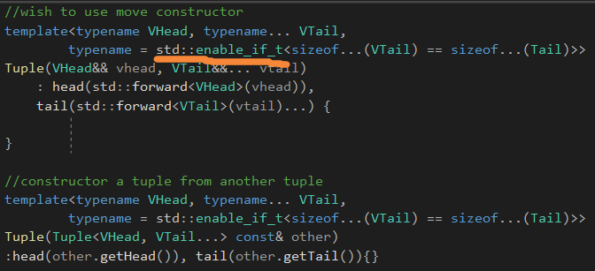

如果不加这个限制条件的话，那么传入一个tuple到构造函数的话，**会选择第一个，传给VHead**，造成类型不匹配。

需要加这个限制来关闭函数模板。

```c++
template<typename... Types>
	auto makeTuple(Types&&... elems)
	{
		return Tuple<std::decay_t<Types>...>(std::forward<Tuples>(elems)...);
	}
```

函数模板相对于类模板的优势就是，会自动推导，可以裹一层，这样就不需要指定类型了。


std::decay主要是为了**解决原生数组和字面值常量的退化**，退化到指针。


# Tuple Algorithms


Tuple算法，它们需要编译时间和运行时间的开销。


应用一个算法到tuple上，**会产生一个完全不同的类型**，需要编译时间的计算。

而像其它同质容器，tuple也需要在运行时进行计算。


typelist算法被应用到元组类型经常被用来**决定结果元组类型。**

**也就是生成相应的新元组类型。**


元组算法实际上需要代码执行在运行期间，我们需要小心生成的代码的运行效率。

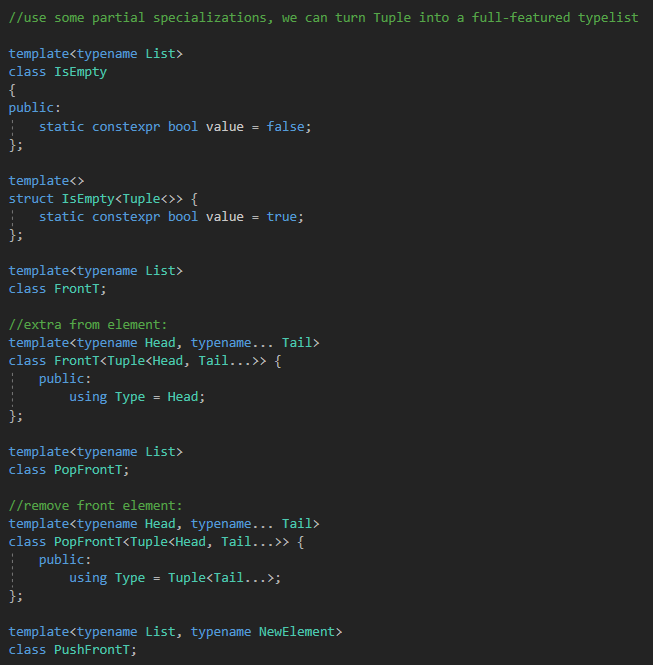

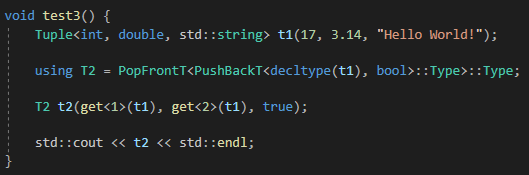

typelist算法应用到元组类型，被经常用来帮助决定一个元组算法的结果类型。

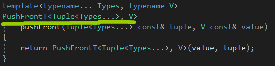

添加和移除元素的方式，是构造一个新的类型，以及用别的元组和值重新构造这个元组。


编译期间的PushFront计算了类型，我们需要去构造生成正确的运行期间的值。

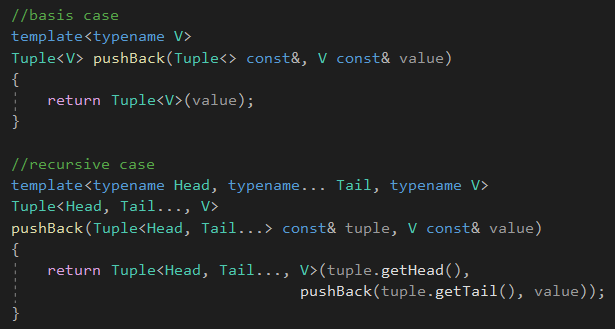

pushback比较麻烦，需要递归。


## Reversing a Tuple

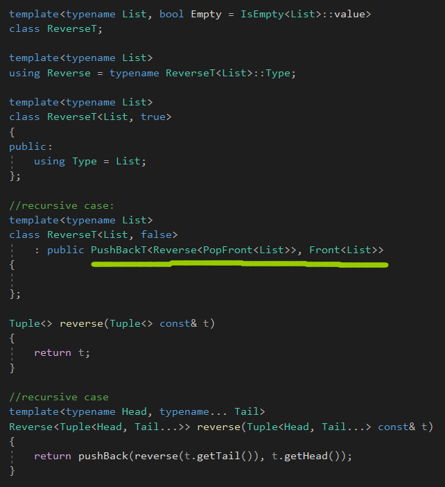

注意这里，必须使用别名模板，不能使用FrontT&lt;List&gt;::Type这样的形式，不然会报错。要写成typename FrontT&lt;List&gt;::Type这样的形式。

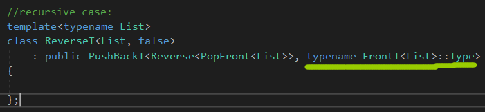


## Index Lists

递归执行的元组遍历是正确的，但是它是不够高效地在运行期间。

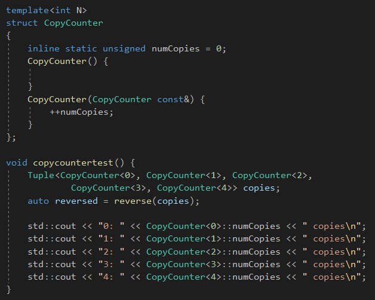

我们用这个来统计元组里面的元素被拷贝的数量。


在理想的tuple reverse的实现中，每个元素只会被拷贝一次。

我们可以达成这个目标，通过使用引用。


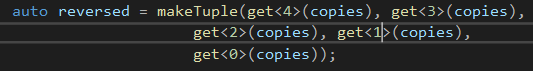

我们可以使用索引列表，翻转索引，而不是元组。


索引列表扩展了这个概念通过捕获元组的索引到一个参数包，允许get调用的序列被生产通过包扩展。


标准库提供了std::integer_sequence，被用来表示索引列表。


## Reversal with Index Lists

对于我们的index list，我们会使用Valuelist类型。


看起来像这样，上一章的内容，非类型List。

```c++
Valuelist<unsigned, 4, 3, 2, 1, 0>;
```


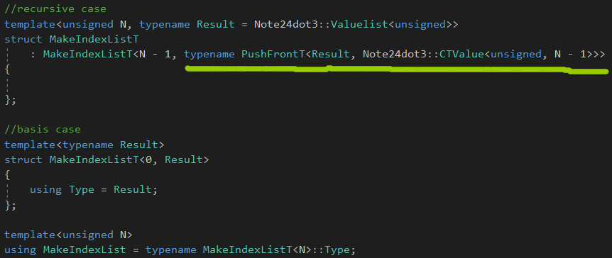

我们可以使用一个类模板，生成一个索引列表，CTValue是一个类型，N表示长度。

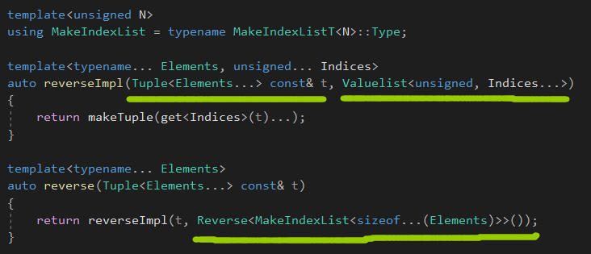

改良版本的reverse，生成一个IndexList，然后翻转后，构造元组的时候，通过get来获取引用。

reverseImpl将index list的lidices捕获到非类型参数包。


注意，这里get&lt;Indices&gt;返回一个临时的右值，要统计的话，还要写个移动拷贝构造函数。


注意，ValueList自己有一套操作类型函数，而Tuple自己也有一套。


Reverse会使用ValueList自己那套操作类型函数。


## Shuffle and Select


选择元组中特定范围内的集合。

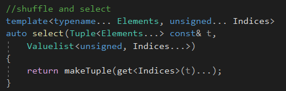


一个构建在select()的算法是tuple "splat"操作，获取tuple里面的一个元素然后拷贝多份。

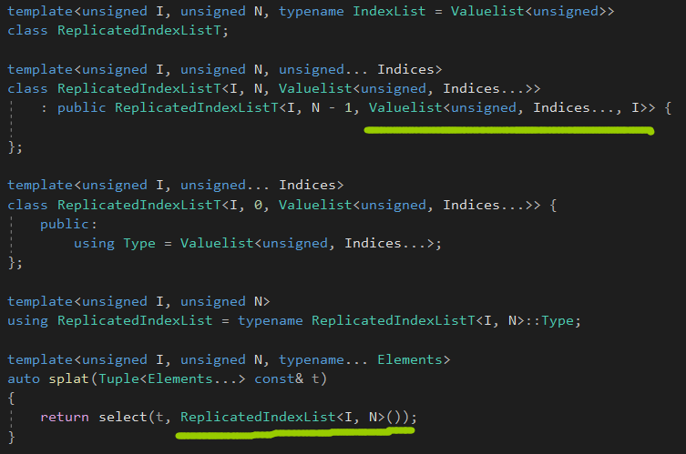

ReplicatedIndexList生成N个I，放入Valuelist。


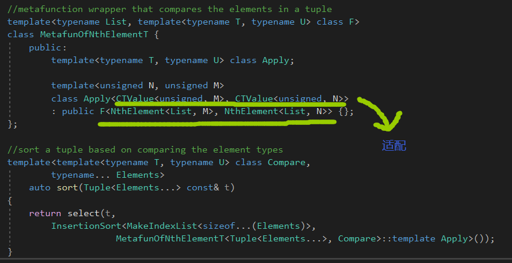

InsertionSort，接收一个类型列表，同时一个metafunction，用来比较，metafunction，接收两个模板类型参数。


和下面这个很像。

```c++
std::vector<std::string> strings = {"banana", "apple", "cherry"};

std::vector<unsigned> indices = {0, 1, 2};

std::sort(indices.begin(), indices.end(),
		[&strings](unsigned i, unsigned j)
		{
			return strings[i] < strings[j];
		});
```


sort()排序索引，lambda被提供作为比较操作，接收两个unsigned value(而不是string值)。

排序根据string的内容。


MetafunOfNthElementT适配出了一个内联的Apply，接收两个索引CTValue，并且使用NthElement去抽取相应的元素。


sort的排序都是在编译期间进行的。


# Optimizing Tuple

优化的方面：

1.运行时间(存储，执行时间)

2.编译时间(有多少**数量**的模板被实例化)


## Tuples and the EBCO


大多数非空tuple会在一个空tupe上面终止，数据成员总是要占一个字节的。


我们可以使用EBCO，空基类优化，通过从Tail Tuple继承，**而不是直接作为数据成员。**


