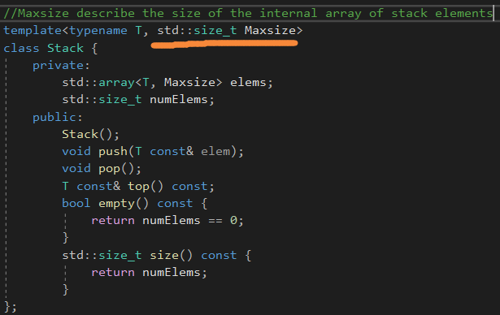
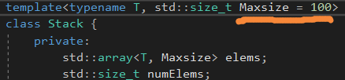
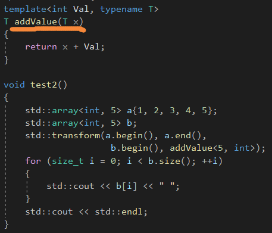
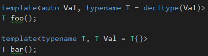
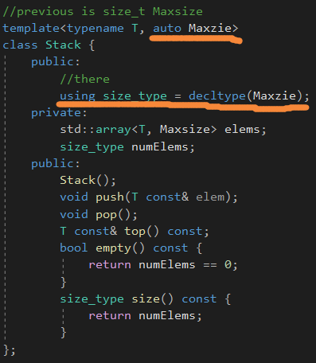
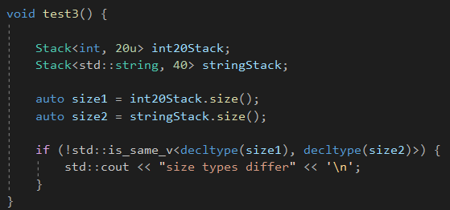

# Nontype Template Parameters


一个好的措施是让stack的用户描述数组的大小，作为最大所需的大小，对于栈元素。




numElems是当前容器内元素的个数。




默认模板参数的值也是可以指定的。


# Nontype Function Template Paramters



这个函数模板定义了一系列函数，对于一个被确定要加的值来说。


传递一个实例化的函数去加一个值到集合的每个元素中。


推导只适用于直接的调用，std::transform需要一个完整的类型去推导出第四个参数。因此，需要完整地描述第四个参数的类型。


**后面的模板类型参数可以从前面的参数中推导出来。**




也可以保证值的类型和前面传过来的类型相同。


# Restrictions for Nontype Template Parameters

非类型模板参数值只能是整数值，包括枚举，指向对象/函数/成员的指针，到函数和对象的左值引用，

或者std::nullptr_t。


如果是表达式的话，则要求是**编译期间的表达式。**


# Template Parameter Type auto

自从C++17，你可以定义一个非类型模板参数去通用地接收任何类型，那些对非类型模板参数允许的类型。




通过使用占位类型auto。


自从C++14，可以让C++14自己决定返回类型。

```c++
auto size() const{
	return numElems;
}
```


**type trait，std::is_same，可以检测类型是否一致。**




```c++
//C++11
std::is_same<decltype(size1), decltype(size2)>::value
```


