# Variadic Templates


## Variadic Templates

模板参数可以被定义去接收任意数量的模板参数。

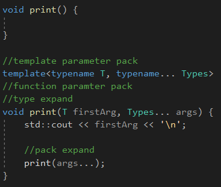

会类似产生这样的展开：

```C++
print<char const*, std::string>("hello", s);
```


## Overloading Variadic and Nonvariadic Templates

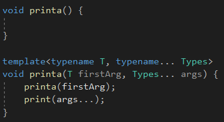

重载解析更倾向于使用**没有尾置参数包**的版本。


## Opeartor sizeof...


可以打印函数参数包和类型参数包。


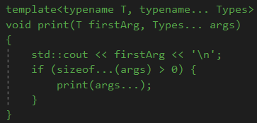

实例化是编译时候的决定，而使不使用这个函数是运行时的决定。

当至少一个参数传过来的时候，这个函数依然会将里面的那个调用实例化，如果没有相应的空函数可以进行调用，则报错。


## fold expressions

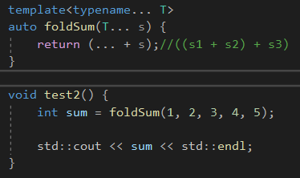

折叠表达式。

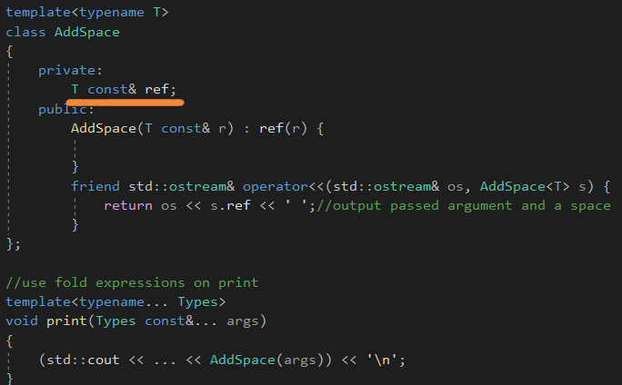

用一个额外的模板类来添加空格，搭配折叠表达式。


## Application of Variadic Templates


可变参数搭配完美转发和移动语义。


普通函数传值和传引用的规则一样适用于可变参数，传值会拷贝和退化，而传引用则保持原来的类型。


## Variadic Class Templates and Variadic Expressions

可变类模板和可变表达式。


参数包可以用在额外的位置，比如，表达式，类模板，别名声明，甚至推导指导。


## Variadic Expressions

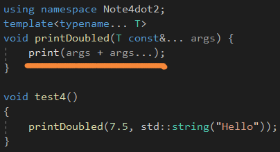

printDoubled会展开如下：

```c++
print(7.5 + 7.5, std::string("Hello") + std::string("Hello"));
```


编译时间的表达式可以包含模板参数包在同样的方式。

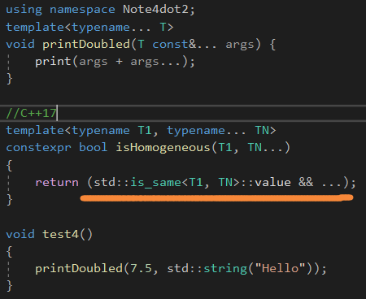

## Variadic Indices

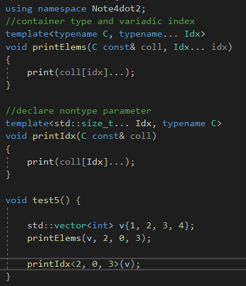

## Variadic Class Templates


```c++
//持有元素
template<typename... Elements>
class Tuple;

Tuple<int, std::string, char> t;

//持有类型对象
template<typename... Types>
class Variant;

Variant<int, std::string, char> v;

//表示一系列的索引
template<std::size_t...>
struct Indices{

};
```

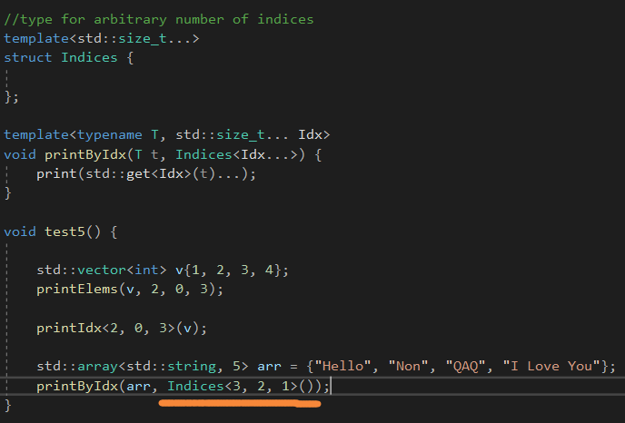

元函数，matefunction的第一步。


## Variadic Deduction Guides

可变演绎推导。


C++定义了如下的演绎推导，对于std::array：

```C++
namespace std{
	template<typename T, typename... U> array(T, U...)
	->array<enable_if_t<(is_same_v<T, U> && ...), T>, (1 + sizeof...(U))>;
}

//is_same_v<T, U>&&...展开的形式
is_same_v<T, U1> && is_same_v<T, U2> && is_same_v<T, U3>
    
//如果结果不是true的，那么演绎推导就会失败
```


## Variadic Base Classes and using

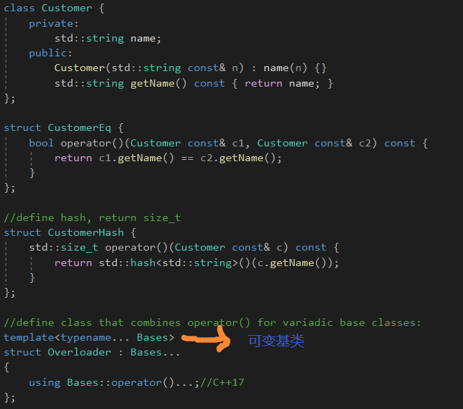

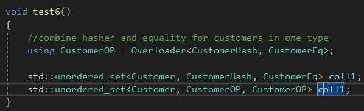

unordered_set的第一个类型参数是hash，第二个类型参数是eq，**会调用它们的()去进行比较。**


