# Tricky Basics


# Keyword typename

```c++
template<typename T>
class MyClass{
	public:
	...
	void foo(){
		typename T::SubType* ptr;
	}
};
```


typename用来表示那些依赖于**模板参数**的类型。


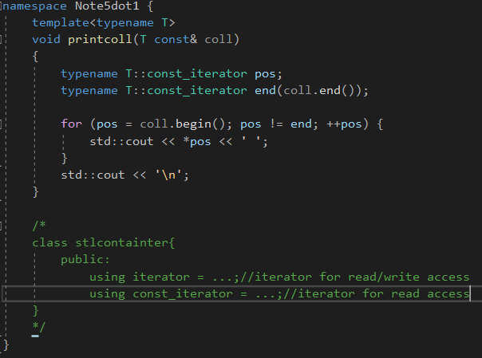

主要的应用，用typename表示一个类型，iterator、const_iterator这种，在标准容器里面，使用using来声明。


# Zero Initialization


内建类型没有构造函数，有着未确定的值。


可以使用如下的方式：

```c++
template<typename T>
void foo()
{
	T x{};
}
```


这个初始化叫做值初始化。它要么调用一个已经提供的构造函数或者**零初始化**一个对象。


C++11之前的解决方法：

```c++
T x = T();
```

**这个机制只允许为拷贝初始化选择的拷贝构造函数不是显式的。**


为了保证一个类模板的成员，类型是参数化的，被初始化。

有2种方式解决：

```c++
template<typename T>
class MyClass{
	private:
		T x;
	public:
		MyClass():x{}{
		
		}
}

//C++11之前
MyClass():x(){

}

//自从C++11，你可以为一个非静态成员提供一个默认值
template<typename T>
class MyClass{
    private:
    	T x{};
}
```


# Using this->


```c++
template<typename T>
class Base{
	public:
		void bar();
};

template<typename T>
class Derived : Base<T>{
	public:
		void foo(){
			bar();//error
			this->Base<T>::bar();
		}
}
```


那些依赖模板参数的基类，我们调用它们的函数，需要显式指定。


# Templates for Raw Arrays and String Literals


传引用不会退化，传值会退化。


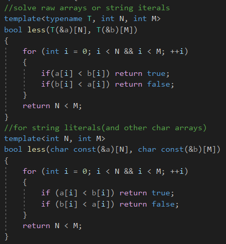

第一个处理原生数组和字符串字面值，第二个既可以处理字符串字面值或者其它字符数组。


可以使用**类的部分特例化机制**来重载。


有边界的没有引用和有引用的一组，没有边界的没有引用和引用的一组，指针一组。

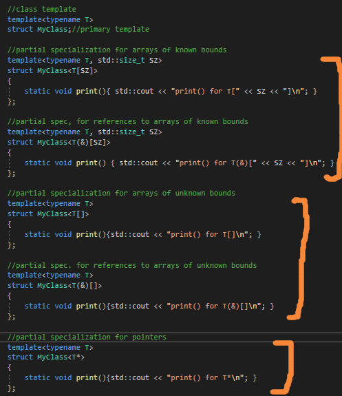

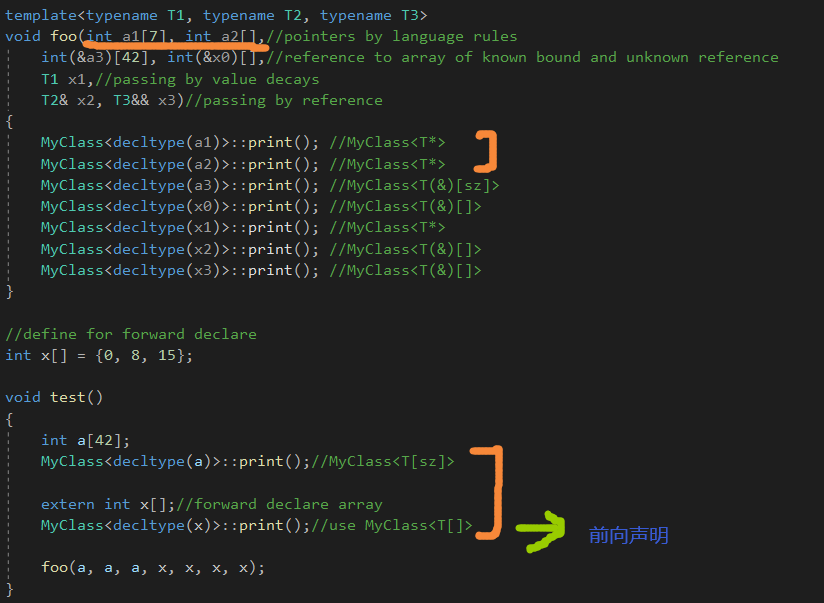

由于语言规则，传入的参数的第一和第二个，会变成指针，这是注意点。


# Member Templates


类模板定义一个成员模板。


比如赋值运算符，这样就可以用一个不同类型的类进行隐式转换了。


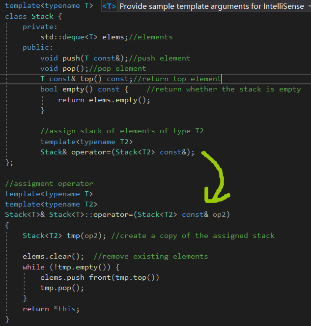

但是有一个问题，Stack&lt;T2&gt;实例化后是一个完全不同的类型，只能使用它的公有接口来访问元素。

而不能直接访问它的元素，所以需要将op2拷贝一份。


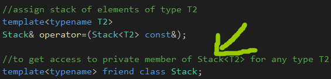

解决方法，授权给所有的实例进行访问。


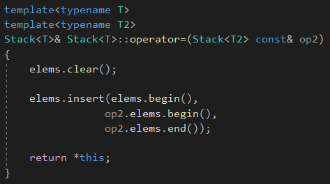

改良版本如上。


类模板的成员函数只有被用到的时候才会进行实例化，否则不会进行实例化。


**成员函数模板的特例化**

成员函数模板可以部分或者完全地特例化。

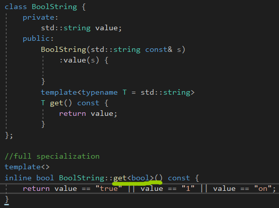

完全的特例化，这个类的大概意思就是**那些有真的含义的字符串**，就返回bool。


## Special Member Function Templates


成员函数模板可以是构造函数。

模板构造或者模板赋值不会替换掉预定义的构造或者赋值操作。

成员模板不被看作是那种可以拷贝或者移动对象的特殊成员函数。

在这个例子中，对于相同类型的stack的赋值操作，**默认赋值操作符仍然被调用。**


也就是虽然定义了赋值操作的成员模板，**但是还是调用了相同类型的赋值操作。**


## The .template Construct


有时候必须显式修饰模板参数，当调用一个成员模板。

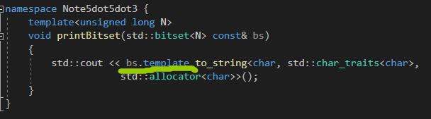

对于bitset，我们调用了它的成员函数模板to_string()。

没有这个.template，接下来的那个<会被当成小于号。

**这个问题只发生在点号之前的构造依赖于模板参数时，参数bs取决于模板参数N。**


## Generic Lambdas and Member Templates

注意通用lambda，C++14的东西，**是成员函数模板的捷径。**

```c++
[](auto x, auto y){
	return x + y;
}

//等价于如下的东西
class SomeCompilerSpecificName{
	public:
		SomeCompilerSpecificName();//构造函数只被编译器调用
		template<typename T1, typename T2>
		auto operator()(T1 x, T2 y) const{
			return x + y;
		}
};
```


# Variable Templates


值可以被参数化，通过一个确定的类型。叫做变量模板。


值的类型可以确定。


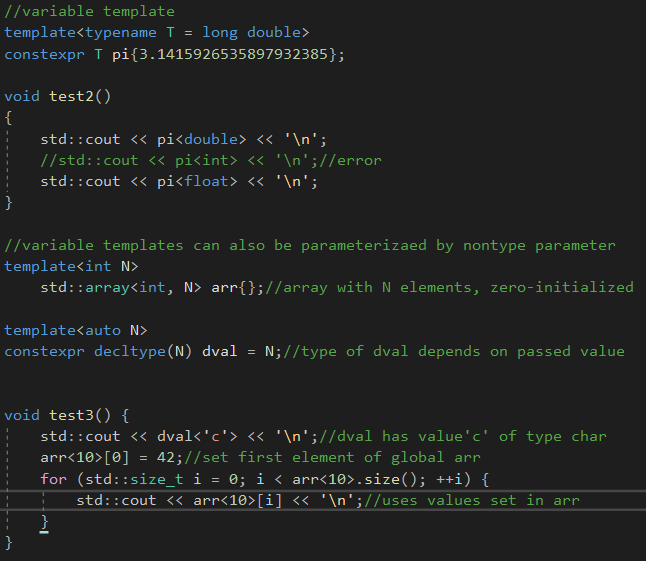

dval的模板类型参数是一个值，**然后decltype进行推导。**


## Variable Templates for Data Members


变量模板一个非常有用的特性是去定义变量，**表示类模板的成员。**


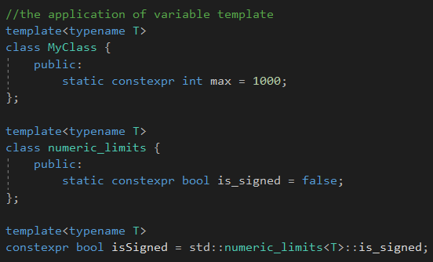

标准库里面的设施，同时可以用别名模板进行简化。


## Type Traits Suffix_v

自从C++17，标准库设施使用变量模板去定义标准库里面的类型萃取，**去产生一个bool值。**

```c++
std::is_const_v<T>//since c++17

std::is_const<T>::value //c++11

namespace std{
	template<typename T> constexpr bool is_const_v = is_const<T>::value;
}
```


## 总结

变量模板就是去确定一个值的类型。


