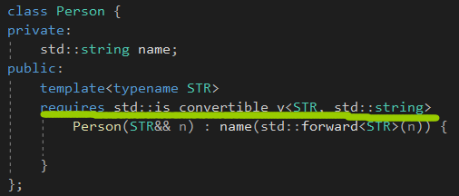

# Move Semantics and enable_if<>

# Perfect Forwarding

如果没有完美转发，我们要把每个类型都写出来。注意，这里的右值引用是个左值。

std::move，把v返回，变成一个临时对象。

完美转发，T&&是个万能引用。

注意，std::move是用来触发移动语义的，std::forward()完美转发。

注意，对于一个模板参数T，**一个声明比如typename T::iterator&&是一个右值引用。**

完美转发和可变模板一起使用。

# Special Member Function Templates

成员函数模板可以被用来作为**特殊成员函数**，包括构造函数。

Person p3(p1)，会出错，因为这个函数是explicit的，STR被推导为Person&，把Person&强制转换成name会出错。

而不会调用下面那么Person(Person const& p)，提供一个非常量左值版本只是一部分解决了，对于派生类来说，它们更倾向于模板版本。

如果存在一种东西，对于传递过来的参数是Person，或者是一个表达式，可以转换成Person，**可以是std::enable_if。**

# Disable Templates with enable_if<>

自从C++11，C++标准库提供一个帮助函数std::enable_if<>去**忽略函数模板**在特定编译时间的情况下。

如果T的类型大小大于4，那么这个表达式就会产生true，那么这个函数就会被实例化。

std::enable_if<>是一个类型萃取，计算一个编译期间的表达式。

如果表达式为true，它的类型成员type产生一个类型：

-type是void，如果第二个模板参数没有传递

-否则，type是第二个模板参数type

如果表达式为false，由于一个模板特性**SFINE**，替换失败不是一个错误。**成员type就不会被定义。**

这个函数模板以及enable_if表达式就会被忽略。

自从C++14，可以使用std::enable_if<>，可以跳过typename和::type。

常见的写法是这样的，作为默认模板参数，因为前面的写法比较笨拙。

使用别名模板再次简化。

# Using enable_if<>

使用enable_if<>，就能解决我们之前的问题，如果我们传递的STR是个正确的类型。

std::is_convertible<FROM, TO>，**因为之前我们的STR不能转换成std::string，所以就失败了。**

如果不能转换成类型std::string，整个函数模板会被忽略掉。

我们也可以使用我们自己的别名模板。

另一个类型萃取，T是否能够构造成std::string。

# Disabling Special Member Functions

我们不能使用enable_if<>去关闭预定义的拷贝/移动构造和赋值操作运算符。

原因是因为成员函数模板永远不会被作为一个特殊的成员函数，**并且因此被忽略掉。**

拷贝构造函数是一定需要的。

一种解决方式，定义一个拷贝构造函数，为const volatile的，然后后面的拷贝就会更倾向于使用模板成员函数。

我们更进一步，应用enable_if。

intergral用来判断一个类型是不是完整的。

# Concepts

新的语言特性。

或者这样。

或者这样。