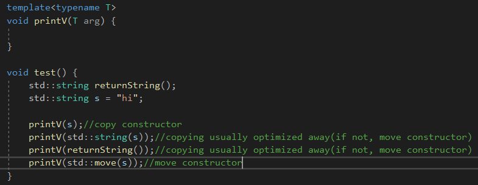
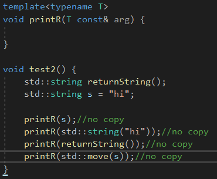
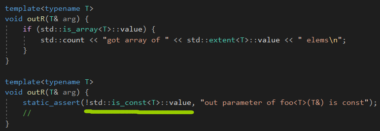
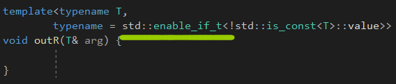
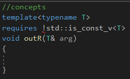
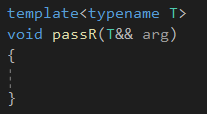
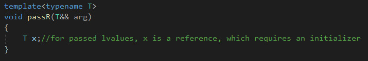
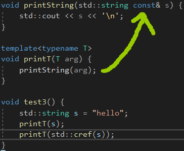
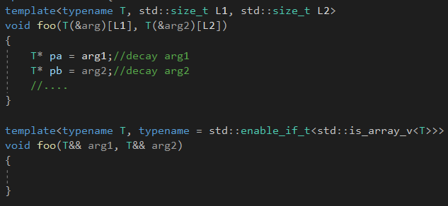
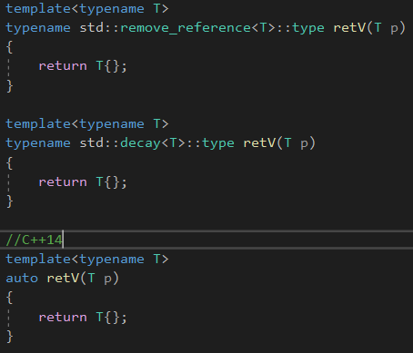

# By Value or by Reference?


# Passing by Value


当传值的时候，每个参数必须是可以拷贝的。


调用一个拷贝构造函数是昂贵的。但是这里有一些方法可以避免拷贝，当参数传值的时候。

使用移动语义。



这里，std::move强制把一个左值变成了一个右值，而第二个和第三个的参数是一个prvalues(随意创建的临时值或者被另一个函数返回的值)。


xvalue(一个存在的非常量引用，使用了std::move())。


# Passing by Value Decays

传值退化。


传值的另一个属性。


原生数组会退化成指针，而那些修饰符const和volatile会被移除，**auto也是这样的操作。**


这有个好处，就是简化了传递字面值和原生数组，但是无法分别传递过来的类型是什么。


# Passing by Reference




有一个小小的问题，就是如果参数是左值引用，那么编译器编译代码的时候，会将外面的一些值cache到寄存器里面，如果被调用的函数，修改了外面的值，那么寄存器里面的值就没用了，这种保存措施就很消耗性能。

这个情况是合理的，因为对于内联函数，编译器会进行展开，调用者和非调用者的代码就会在一起，就不会使用左值引用，而是直接使用值。


## Passing by Nonconstant Reference

传递一个pvalue或者xvalue到一个非常量引用上，会发生错误。


如果你想关闭传递常量对象到非常量引用。

可以使用如下的方式：



这样就不能传递一个常量对象到一个非常量引用。




使用std::enable_if_t，来关闭模板。




可以使用C++20的concept。


## Passing by Forwarding Reference

使用传引用的另一个理由，就是搭配完美转发。



万能引用搭配完美转发，万能引用，能够保持住参数的完整类型，但是会加上引用。

这是唯一的缺点。



也就是传入一个int，T会被推导为int&，如果在函数内部定义了一个T x，那就会报错。


# Using std::ref() and std::cref()


ref可以用来传值，它内部是一个引用，引用一个对象。

std::reference_wrapper<>包裹了一个对象，引用了一个原始的对象，它自己传值。


这个wrapper或多或少地支持一个操作：一个隐式的类型转换回原先的类型，产生一个原先的对象。



要转换回原先的对象，常见操作就是传递给一个非模板函数，**不然std::reference_wrapper<>会报错，缺少输出运算符。**


# Dealing with String Literals and Raw Arrays


std::decay<>解决完美转发的问题，而std::common_type<>，也是一种隐式的退化，产生两个传递的类型的公有类型。


## Special Implementations for String Linterals and Raw Arrays



两者解决方法，第一种就是我们之前写的，但是要分别别类地全写出来。

第二种，就是用std::is_array**判断传递过来的是array还是指针。**


# Dealing with Return Values

返回值可以传值传引用。


为了让返回值是传值的，我们需要一些小手段。



三种解决方法，decay隐式地去除了引用，**而C++14的auto本身也自带了退化。**


# Recommended Template Parameter Declarations


传值的优点，就是传递字面值和字符串的时候，会退化，但是对于大对象来说，就需要std::ref和std::cref这样的东西。


通用的推荐如下：


1.默认情况下，使用传值。搭配std::ref和std::cref。


2.如果使用out或者inout参数，返回一个对象或者修改调用者传入的参数，传递参数作为一个非常量引用。


如果一个模板被提供用来转发一个参数，使用完美转发。

声明一个参数是转发引用和使用std::forward<>()是正确的。使用std::decay<>和std::common_type<>去协调字符串字面值和原生数组的不同类型。


**如果性能是关键，就使用常量引用。**


## std::make_pair() Example


C++11

```c++
template<typename T1, typename T2>
constexpr pair<typename decay<T1>::type, typename decay<T2>::type>
make_pair(T1&& a, T2&& b)
{
	return pair<typename decay<T1>::type,
				typename decay<T2>::type>
				(forward<T1>(a),
				 forward<T2>(b));
}
```


实际的实现很复杂，为了支持std::ref和std::cref，函数需要去解包，从std::reference_wrapper到真实的引用。


