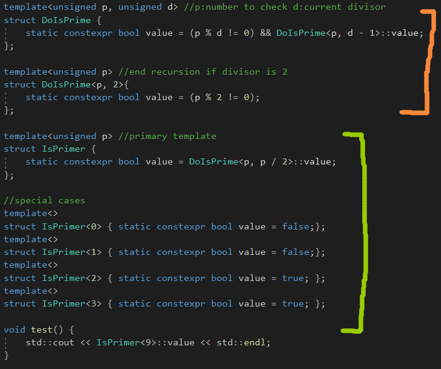

# Compile-Time Programming

# Template Metaprogramming

模板在编译期间进行实例化。

C++模板的一些特性可以和实例化过程结合起来，产生一种基本的递归编程语言。

模板可以用来计算一个程序。

注意两种情况，IsPrimer和DoIsPrimer，特例化的版本和部分特例化的版本要注意，**还要在类名后面写东西的。**

DoIsPrime会不断地展开的，实例化不同的类型。

而且还定义了一些特例化的版本。

# Computing with constexpr

C++11的新特性，constexpr，简化了不同形式的编译期间的计算。

给定一个正确的输入，一个constexpr函数可以在编译期间进行计算。

但是，C++11的constexpr有些限制，就是必须只有一条返回语句。而C++14，则移除了这个限制。

由于只有一条语句的限制，我们可以使用条件语句作为一个**选择机能。**

C++14移除了只有一条语句的限制。

如果不能在编译期间计算，那么就在运行期间进行计算，**并不会报错。**

# Execution Path Selection with Partial Specialization

执行路径，使用部分特例化实现。

使用部分特例化去选择，在编译期间，在不同的实现之间。

一个主模板，和两个部分特例化版本。

也可以如下：

注意，这里的主模板是有实现的。

由于函数模板不支持部分特例化，你必须使用其它机能去改变函数模板基于特定的限制。

1.使用类和静态函数

2.使用std::enable_if

3.使用SFINAE特性

4.使用编译期间的if

# SFINAE(Substitution Failure Is Not An Error)

在C++，那是非常寻常地去重载函数，将不同的参数类型考虑进来。

在考虑函数模板的候选集，编译器第一步需要决定哪个模板参数应当用于那个候选集，

**然后替换这些函数参数列表中的参数和它的返回值，然后计算它匹配的如何。**

会产生一些无意义的结构，替换失败不是错误。**我们叫这个为SFINAE。**

对于int a[10]，会调用第一个函数模板，第二个函数模板也会进行替换，但是T类型，没有size_type，因此会忽略这个调用。

忽略一个候选者，当替换它的返回类型是无意义的，会造成编译器去选择另一个候选者。

我们可以写一个带省略号参数的函数，作为最坏的匹配。

**注意，SFINAE好像是对函数来说的，之后会注意看一下是否是这样的。**

## SFINE and Overload Resolution

SFINE由于太出名，慢慢变成了一个动词，SFINE out表示通过一系列限制，保证函数模板被忽略掉。

标准库里面说这个，这个构造应当与不参与重载解析，如果decay_t&lt;F&gt;和thread是同样类型的。

这个意思是指模板构造被忽略掉，如果它被调用的时候，std::thread是第一个参数，并且只有一个参数。

原因是，否则，**像这样的成员模板有时可能比任何预定义的复制或移动构造函数更匹配。**

通过SFINAE掉成员函数模板，我们保证预定义的拷贝或者移动构造总是被使用，当一个线程从另一个线程构造的时候。

它允许我们关闭一个模板，通过替换一个类型，在那个条件中构造。

## Expression SFINAE with decltype

用decltype检查是否使用SFINAE？

逗号表达式，返回最后一个表达式，如果前面的表达式成立的话。

这样，我们就可以检查那种有size_type，但是没有size()成员函数的类。

# Compile-Time if

注意，那些不依赖模板参数的语句依赖会被执行和检查。

